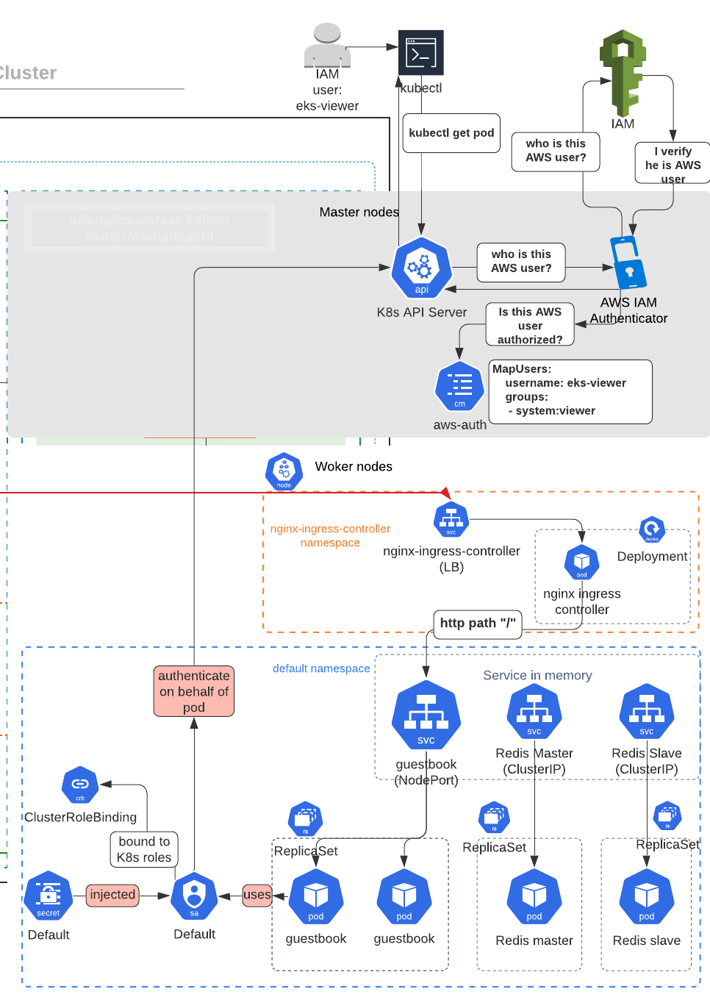

# Pod Level Authorization using IRSA (IAM Role for Service Account)

## Pod Authentication


## Default Pod Authorization using Node's instance profile


## Pod Authorization using AWS IAM Role (IRSA)


By default, K8s pods use __EKS worker node's instance profile__ available at instance metadata endpoint (accessing `http://169.254.169.254/latest/meta-data/` from inside container to get temp AWS access key and secret access key, which is tied to AWS IAM role wrapped inside instance profile for EC2) to access AWS services.

This is not ideal as all the pods on nodes will get the same permissions and therefore breaking the __principle of the least priviledge__.

The solution is to define and assign a specific AWS IAM role to K8s pod, called IRSA (Iam Role for Service Account).


# Step 1: Understand the requirements for IRSA

AWS IRSA doc: https://docs.aws.amazon.com/eks/latest/userguide/iam-roles-for-service-accounts.html says there are 3 steps:
1. (req1) Create an IAM OIDC provider for your cluster
2. (req2) Create an IAM role and attach an IAM policy to it with the permissions that your service accounts need
3. (req3) Associate an IAM role with a service account


# Step 2: (req1) Create an IAM OIDC provider for your cluster

AWS Terraform module for eks has an example enabling IRSA: https://github.com/terraform-aws-modules/terraform-aws-eks/tree/master/examples/irsa

We have already copied the EKS module files in resource layer, particulary relevant to IRSA is `irsa.tf` in [resource_modules/container/eks/irsa.tf](resource_modules/container/eks/irsa.tf):
```sh
# Enable IAM Roles for EKS Service-Accounts (IRSA).

# The Root CA Thumbprint for an OpenID Connect Identity Provider is currently
# Being passed as a default value which is the same for all regions and
# Is valid until (Jun 28 17:39:16 2034 GMT).
# https://crt.sh/?q=9E99A48A9960B14926BB7F3B02E22DA2B0AB7280
# https://docs.aws.amazon.com/IAM/latest/UserGuide/id_roles_providers_create_oidc_verify-thumbprint.html
# https://github.com/terraform-providers/terraform-provider-aws/issues/10104

resource "aws_iam_openid_connect_provider" "oidc_provider" {
  count           = var.enable_irsa && var.create_eks ? 1 : 0 # <---- enable_irsa is a flag
  client_id_list  = [local.sts_principal]
  thumbprint_list = [var.eks_oidc_root_ca_thumbprint]
  url             = flatten(concat(aws_eks_cluster.this[*].identity[*].oidc.0.issuer, [""]))[0]
}
```

Basically, if `enable_irsa` input variable value is true, then this `irsa.tf` will create `aws_iam_openid_connect_provider` resource which is required to enable IRSA ([AWS doc](https://docs.aws.amazon.com/eks/latest/userguide/iam-roles-for-service-accounts.html)).


# Step 3: Set `enable_irsa` input variable value to true terraform.tfvars in `Composition` layer

In [composition/eks-demo-infra/ap-northeast-1/prod/terraform.tfvars](composition/eks-demo-infra/ap-northeast-1/prod/terraform.tfvars), define value for `enable_irsa`
```sh
## IRSA (IAM role for service account) ##
enable_irsa      = true
```

In [composition/eks-demo-infra/ap-northeast-1/prod/main.tf](composition/eks-demo-infra/ap-northeast-1/prod/main.tf), assign the value of `enable_irsa` in composition layer to infrastructure layer's input variable `enable_irsa`:
```sh
########################################
# EKS
########################################
module "eks" {
  source = "../../../../infrastructure_modules/eks"

  ## EKS ##
  create_eks      = var.create_eks
  cluster_version = var.cluster_version
  cluster_name    = local.cluster_name
  vpc_id          = local.vpc_id
  subnets         = local.private_subnets

  # note: either pass worker_groups or node_groups
  # this is for (EKSCTL API) unmanaged node group
  worker_groups = var.worker_groups

  # this is for (EKS API) managed node group
  node_groups = var.node_groups

  # add roles that can access K8s cluster
  map_roles = local.map_roles

  # specify AWS Profile if you want kubectl to use a named profile to authenticate instead of access key and secret access key
  kubeconfig_aws_authenticator_env_variables = local.kubeconfig_aws_authenticator_env_variables

  ## IRSA (IAM role for service account) ##
  enable_irsa    = var.enable_irsa # <------- STEP 2
```


Also define `enable_irsa` input variable in [composition/eks-demo-infra/ap-northeast-1/prod/variables.tf](composition/eks-demo-infra/ap-northeast-1/prod/variables.tf),
```sh
## IRSA & cluster autoscaler ##
variable "enable_irsa" {
  description = "Whether to create OpenID Connect Provider for EKS to enable IRSA	"
}
```


# Step 4: Pass down `enable_irsa` input variable from infrastructure layer to resource module layer

In [infrastructure_modules/eks/main.tf](infrastructure_modules/eks/main.tf), set `cluster_enabled_log_types` value to resource module's `cluster_enabled_log_types`
```sh
# ref: https://github.com/terraform-aws-modules/terraform-aws-eks/blob/master/examples/basic/main.tf#L125-L160
module "eks_cluster" {
  source = "../../resource_modules/container/eks"

  create_eks      = var.create_eks
  cluster_version = var.cluster_version
  cluster_name    = var.cluster_name
  kubeconfig_name = var.cluster_name
  vpc_id          = var.vpc_id
  subnets         = var.subnets

  worker_groups                        = var.worker_groups
  node_groups                          = var.node_groups
  worker_additional_security_group_ids = var.worker_additional_security_group_ids

  map_roles                                  = var.map_roles
  # map_users                                  = var.map_users
  kubeconfig_aws_authenticator_env_variables = var.kubeconfig_aws_authenticator_env_variables

  enable_irsa                   = var.enable_irsa # <------- STEP 3
```


Also define `enable_irsa` input variable in [infrastructure_modules/eks/variables.tf](infrastructure_modules/eks/variables.tf),
```sh
## IRSA & cluster autoscaler ##
variable "enable_irsa" {
  description = "Whether to create OpenID Connect Provider for EKS to enable IRSA	"
}
```


# Step 5: Terraform apply

```sh
cd composition/eks-demo-infra/ap-northeast-1/prod

# will use remote backend
terraform init -backend-config=backend.config

# usual steps
terraform plan
terraform apply

# output 
  + create
  ~ update in-place
+/- create replacement and then destroy

Terraform will perform the following actions:

      # module.eks.module.eks_cluster.data.template_file.userdata[0] will be read during apply
  # (config refers to values not yet known)
 <= data "template_file" "userdata"  {
      ~ id       = "6dcf640bbea6d3bedf141829385d1a94b8eb0ffbfd854947ed75bea8522fe030" -> (known after apply)
      ~ rendered = <<-EOT
            #!/bin/bash -e
            
            # Allow user supplied pre userdata code
            
            
            # Bootstrap and join the cluster
            /etc/eks/bootstrap.sh --b64-cluster-ca 'zzz' --apiserver-endpoint 'https://8BCC4AF6E74FFBAEDA5F0675CCD92C4F.gr7.ap-northeast-1.eks.amazonaws.com'  --kubelet-extra-args "--node-labels=env=prod,unmanaged-node=true --register-with-taints=prod-only=true:NoSchedule" 'eks-apne1-prod-terraform-eks-demo-infra'
            
            # Allow user supplied userdata code
        EOT -> (known after apply)
        # (2 unchanged attributes hidden)
    }

  # module.eks.module.eks_cluster.aws_autoscaling_group.workers[0] will be updated in-place
  ~ resource "aws_autoscaling_group" "workers" {
        id                        = "eks-apne1-prod-terraform-eks-demo-infra-worker-group-prod-120210321184411189300000015"
      ~ launch_configuration      = "eks-apne1-prod-terraform-eks-demo-infra-worker-group-prod-120210321191129042800000001" -> (known after apply)
        name                      = "eks-apne1-prod-terraform-eks-demo-infra-worker-group-prod-120210321184411189300000015"
        # (22 unchanged attributes hidden)

        # (6 unchanged blocks hidden)
    }

  # module.eks.module.eks_cluster.aws_cloudwatch_log_group.this[0] will be updated in-place
  ~ resource "aws_cloudwatch_log_group" "this" {
        id                = "/aws/eks/eks-apne1-prod-terraform-eks-demo-infra/cluster"
        name              = "/aws/eks/eks-apne1-prod-terraform-eks-demo-infra/cluster"
      ~ retention_in_days = 365 -> 90
        tags              = {
            "Application" = "terraform-eks-demo-infra"
            "Environment" = "prod"
        }
        # (1 unchanged attribute hidden)
    }

  # module.eks.module.eks_cluster.aws_iam_openid_connect_provider.oidc_provider[0] will be created
  + resource "aws_iam_openid_connect_provider" "oidc_provider" {  # <------ OIDC provider will be created
      + arn             = (known after apply)
      + client_id_list  = [
          + "sts.amazonaws.com",
        ]
      + id              = (known after apply)
      + thumbprint_list = [
          + "9e99a48a9960b14926bb7f3b02e22da2b0ab7280",
        ]
      + url             = "https://oidc.eks.ap-northeast-1.amazonaws.com/id/8BCC4AF6E74FFBAEDA5F0675CCD92C4F"
    }

  # module.eks.module.eks_cluster.aws_launch_configuration.workers[0] must be replaced
+/- resource "aws_launch_configuration" "workers" {
      ~ arn                              = "arn:aws:autoscaling:ap-northeast-1:266981300450:launchConfiguration:4bf8f80b-ffda-4edc-90f5-7d1f4043b1d9:launchConfigurationName/eks-apne1-prod-terraform-eks-demo-infra-worker-group-prod-120210321191129042800000001" -> (known after apply)
      ~ id                               = "eks-apne1-prod-terraform-eks-demo-infra-worker-group-prod-120210321191129042800000001" -> (known after apply)
      + key_name                         = (known after apply)
      ~ name                             = "eks-apne1-prod-terraform-eks-demo-infra-worker-group-prod-120210321191129042800000001" -> (known after apply)
      ~ user_data_base64                 = "zzz" -> (known after apply) # forces replacement
      - vpc_classic_link_security_groups = [] -> null
        # (8 unchanged attributes hidden)

      + ebs_block_device {
          + delete_on_termination = (known after apply)
          + device_name           = (known after apply)
          + encrypted             = (known after apply)
          + iops                  = (known after apply)
          + no_device             = (known after apply)
          + snapshot_id           = (known after apply)
          + volume_size           = (known after apply)
          + volume_type           = (known after apply)
        }

      + metadata_options {
          + http_endpoint               = (known after apply)
          + http_put_response_hop_limit = (known after apply)
          + http_tokens                 = (known after apply)
        }

        # (1 unchanged block hidden)
    }

  # module.eks.module.eks_cluster.random_pet.workers[0] must be replaced
+/- resource "random_pet" "workers" {
      ~ id        = "better-jaybird" -> (known after apply)
      ~ keepers   = {
          - "lc_name" = "eks-apne1-prod-terraform-eks-demo-infra-worker-group-prod-120210321191129042800000001"
        } -> (known after apply) # forces replacement
        # (2 unchanged attributes hidden)
    }

Plan: 3 to add, 2 to change, 2 to destroy.
```


# Step 6: (req2) Create an IAM role and attach an IAM policy to it with the permissions that your service accounts need 

AWS doc for Creating an IAM role and policy for your service account using __Console, eksctl, or CLI__: https://docs.aws.amazon.com/eks/latest/userguide/create-service-account-iam-policy-and-role.html


AWS Terraform module for EKS's example IAM role: https://github.com/terraform-aws-modules/terraform-aws-eks/blob/master/examples/irsa/irsa.tf shows how to create AWS IAM role in __Terraform__ that can be used for IRSA, especially relevant part is `oidc_fully_qualified_subjects` attribute in `iam_assumable_role_admin`
```sh
module "iam_assumable_role_admin" {
  source                        = "terraform-aws-modules/iam/aws//modules/iam-assumable-role-with-oidc"
  version                       = "3.6.0"
  create_role                   = true
  role_name                     = "cluster-autoscaler"
  provider_url                  = replace(module.eks.cluster_oidc_issuer_url, "https://", "")
  role_policy_arns              = [aws_iam_policy.cluster_autoscaler.arn]
  oidc_fully_qualified_subjects = ["system:serviceaccount:${local.k8s_service_account_namespace}:${local.k8s_service_account_name}"] # <----- this is the trick
}

resource "aws_iam_policy" "cluster_autoscaler" {
  name_prefix = "cluster-autoscaler"
  description = "EKS cluster-autoscaler policy for cluster ${module.eks.cluster_id}"
  policy      = data.aws_iam_policy_document.cluster_autoscaler.json
}

data "aws_iam_policy_document" "cluster_autoscaler" {
  statement {
    sid    = "clusterAutoscalerAll"
    effect = "Allow"

    actions = [
      "autoscaling:DescribeAutoScalingGroups",
      "autoscaling:DescribeAutoScalingInstances",
      "autoscaling:DescribeLaunchConfigurations",
      "autoscaling:DescribeTags",
      "ec2:DescribeLaunchTemplateVersions",
    ]

    resources = ["*"]
  }

  statement {
    sid    = "clusterAutoscalerOwn"
    effect = "Allow"

    actions = [
      "autoscaling:SetDesiredCapacity",
      "autoscaling:TerminateInstanceInAutoScalingGroup",
      "autoscaling:UpdateAutoScalingGroup",
    ]

    resources = ["*"]

    condition {
      test     = "StringEquals"
      variable = "autoscaling:ResourceTag/kubernetes.io/cluster/${module.eks.cluster_id}"
      values   = ["owned"]
    }

    condition {
      test     = "StringEquals"
      variable = "autoscaling:ResourceTag/k8s.io/cluster-autoscaler/enabled"
      values   = ["true"]
    }
  }
}
```


Inputs needed are __k8s namespace and service account name__. Let's test IRSA working by creating a `test-irsa` pod in `default` k8s namespace, and attach `test-irsa` service account to the `test-irsa` pod in `default` namespace. And we will give S3 read permissions to the `test-irsa` pod.

In [composition/eks-demo-infra/ap-northeast-1/prod/terraform.tfvars](composition/eks-demo-infra/ap-northeast-1/prod/terraform.tfvars),
```sh
## IRSA (IAM role for service account) ##
enable_irsa                                            = true

# specify k8s namespace and service account
test_irsa_service_account_namespace                = "default"
test_irsa_service_account_name                     = "test-irsa"
```

In [composition/eks-demo-infra/ap-northeast-1/prod/main.tf](composition/eks-demo-infra/ap-northeast-1/prod/main.tf), assign the values of `test_irsa_service_account_namespace` and `test_irsa_service_account_name` in composition layer to infrastructure layer's input variables:
```sh
########################################
# EKS
########################################
module "eks" {
  source = "../../../../infrastructure_modules/eks"

  ## EKS ##
  create_eks      = var.create_eks
  cluster_version = var.cluster_version
  cluster_name    = local.cluster_name
  vpc_id          = local.vpc_id
  subnets         = local.private_subnets

  # note: either pass worker_groups or node_groups
  # this is for (EKSCTL API) unmanaged node group
  worker_groups = var.worker_groups

  # this is for (EKS API) managed node group
  node_groups = var.node_groups

  # add roles that can access K8s cluster
  map_roles = local.map_roles

  # specify AWS Profile if you want kubectl to use a named profile to authenticate instead of access key and secret access key
  kubeconfig_aws_authenticator_env_variables = local.kubeconfig_aws_authenticator_env_variables

  ## IRSA (IAM role for service account) ##
  enable_irsa                                  = var.enable_irsa

  test_irsa_service_account_namespace                = "default"  # <------ STEP 6
  test_irsa_service_account_name                     = "test-irsa"
```


Also define `test_irsa_service_account_namespace` and `test_irsa_service_account_name` input variables in [composition/eks-demo-infra/ap-northeast-1/prod/variables.tf](composition/eks-demo-infra/ap-northeast-1/prod/variables.tf),
```sh
## test_irsa_iam_assumable_role ##
variable "test_irsa_service_account_namespace" {
  description = "K8s namespace under which service account exists"
}
variable "test_irsa_service_account_name" {
  description = "K8s service account (on behalf of pods) to allow assuming AWS IAM role through OIDC via AWS STS"
}
```


# Step 7: Create IAM assumable role and IAM policy modules in infrastructure layer for `test-irsa` pod

In [infrastructure_modules/eks/main.tf](infrastructure_modules/eks/main.tf), define two modules just like [AWS EKS Terraform module example](https://github.com/terraform-aws-modules/terraform-aws-eks/blob/master/examples/irsa/irsa.tf):
```sh
## test_irsa_iam_assumable_role ##
module "test_irsa_iam_assumable_role" {
  source = "../../resource_modules/identity/iam/iam-assumable-role-with-oidc"

  create_role  = var.create_eks ? true : false
  role_name    = local.test_irsa_iam_role_name
  provider_url = replace(module.eks_cluster.cluster_oidc_issuer_url, "https://", "")
  role_policy_arns = [
    data.aws_iam_policy.s3_read_only_access_policy.arn # <------- reference AWS Managed IAM policy ARN
  ]
  oidc_fully_qualified_subjects = ["system:serviceaccount:${var.test_irsa_service_account_namespace}:${var.test_irsa_service_account_name}"] <----- STEP 7: this is where magic happens, specifying which pod in k8s namespace and service account can assume this IAM role
}
```

In [infrastructure_modules/eks/data.tf](infrastructure_modules/eks/data.tf), define local variables and also data resource fetching AWS Managed IAM policy called `AmazonS3ReadOnlyAccess`:
```sh
locals {
    ## test_irsa_iam_assumable_role ##
  test_irsa_iam_role_name = "TestIrsaS3ReadOnlyRole"
}

data "aws_iam_policy" "s3_read_only_access_policy" {
  arn = "arn:aws:iam::aws:policy/AmazonS3ReadOnlyAccess"
}
```

Also define `test_irsa_service_account_namespace` and `test_irsa_service_account_name` input variables in [infrastructure_modules/eks/variables.tf](infrastructure_modules/eks/variables.tf),
```sh
## test_irsa_iam_assumable_role ##
variable "test_irsa_service_account_namespace" {
  description = "K8s namespace under which service account exists"
}
variable "test_irsa_service_account_name" {
  description = "K8s service account (on behalf of pods) to allow assuming AWS IAM role through OIDC via AWS STS"
}
```

However, the module `test_irsa_iam_assumable_role` in infra layer is trying to reference a resource module called `../../resource_modules/identity/iam/iam-assumable-role-with-oidc`:
```sh
module "test_irsa_iam_assumable_role" {
  source = "../../resource_modules/identity/iam/iam-assumable-role-with-oidc"
```

But we haven't created `resource_modules/identity/iam` module yet. We will do that in next step.


# Step 8: Copy over AWS Terraform module for IAM to resource module layer

I have already copied terraform module folders from https://github.com/terraform-aws-modules/terraform-aws-iam/tree/master/modules to [resource_modules/identity/iam](resource_modules/identity/iam):
```sh
$ tree . -d
.
├── compute
│   ├── ec2_key_pair
│   └── security_group
├── container
│   ├── ecr
│   └── eks
│       ├── modules
│       │   ├── fargate
│       │   └── node_groups
│       ├── scripts
│       └── templates
├── database
│   └── dynamodb
├── identity
│   ├── iam
│   │   ├── group # <--------- from AWS Terraform IAM module
│   │   ├── iam-assumable-role-with-oidc   # <--------- from AWS Terraform IAM module
│   │   ├── instance_profile # <--------- from AWS Terraform IAM module
│   │   ├── password_policy # <--------- from AWS Terraform IAM module
│   │   ├── policy # <--------- from AWS Terraform IAM module
│   │   └── role # <--------- from AWS Terraform IAM module
│   └── kms_key
├── network
│   └── vpc
└── storage
    └── s3
```


# Step 9: Terraform apply

```sh
cd composition/eks-demo-infra/ap-northeast-1/prod

# will need to download remote Terraform IAM modules
terraform init -backend-config=backend.config

# usual steps
terraform plan
terraform apply

# output 
  + create
  ~ update in-place
+/- create replacement and then destroy

Terraform will perform the following actions:

# module.eks.module.test_irsa_iam_assumable_role.aws_iam_role.this[0] will be created
  + resource "aws_iam_role" "this" {
      + arn                   = (known after apply)
      + assume_role_policy    = jsonencode(
            {
              + Statement = [
                  + {
                      + Action    = "sts:AssumeRoleWithWebIdentity"
                      + Condition = {
                          + StringEquals = {
                              + oidc.eks.ap-northeast-1.amazonaws.com/id/8BCC4AF6E74FFBAEDA5F0675CCD92C4F:sub = [
                                  + "system:serviceaccount:default:test-irsa",  # <---- IAM role should contain k8s ns and sa names
                                ]
                            }
                        }
                      + Effect    = "Allow"
                      + Principal = {
                          + Federated = "arn:aws:iam::266981300450:oidc-provider/oidc.eks.ap-northeast-1.amazonaws.com/id/8BCC4AF6E74FFBAEDA5F0675CCD92C4F"
                        }
                      + Sid       = ""
                    },
                ]
              + Version   = "2012-10-17"
            }
        )
      + create_date           = (known after apply)
      + force_detach_policies = false
      + id                    = (known after apply)
      + managed_policy_arns   = (known after apply)
      + max_session_duration  = 3600
      + name                  = "TestIrsaS3ReadOnlyRole"
      + path                  = "/"
      + unique_id             = (known after apply)

      + inline_policy {
          + name   = (known after apply)
          + policy = (known after apply)
        }
    }

  # module.eks.module.test_irsa_iam_assumable_role.aws_iam_role_policy_attachment.custom[0] will be created
  + resource "aws_iam_role_policy_attachment" "custom" {
      + id         = (known after apply)
      + policy_arn = "arn:aws:iam::aws:policy/AmazonS3ReadOnlyAccess"
      + role       = "TestIrsaS3ReadOnlyRole"
    }

Plan: 2 to add, 0 to change, 0 to destroy.
```


# Step 10: Verify AWS IAM role created contains k8s namespace and service accoount


# Step 11: (req3) Associate an IAM role with a service account


AWS doc for Associate an IAM role with a service account: https://docs.aws.amazon.com/eks/latest/userguide/specify-service-account-role.html

```sh
apiVersion: v1
kind: ServiceAccount
metadata:
  annotations:
    eks.amazonaws.com/role-arn: arn:aws:iam::<AWS_ACCOUNT_ID>:role/<IAM_ROLE_NAME>
```


For us, I created [test_irsa_serviceaccount.yaml](test_irsa_serviceaccount.yaml):
```yaml
apiVersion: v1
kind: ServiceAccount
metadata:
  annotations:
    eks.amazonaws.com/role-arn: arn:aws:iam::266981300450:role/TestIrsaS3ReadOnlyRole  # <---- paste the IAM role ARN created 
  name: test-irsa # service account name must match with the one specified in AWS IAM role
  namespace: default # namespace must match with the one specified in AWS IAM role
```

Create service account
```sh
# open new shell

# export AWS_PROFILE
export AWS_PROFILE=aws-demo

# set KUBECONFIG
export KUBECONFIG="${PWD}/kubeconfig_eks-apne1-prod-terraform-eks-demo-infra"

# test k8s authentication
kubectl get pod
No resources found in default namespace.

cd ../../../../
# test k8s authentication
kubectl get pod
No resources found in default namespace.

kubectl apply -f test_irsa_serviceaccount.yaml
```


Now, let's create K8s pod and service account in the `default` namespace and verify it has S3 read permission using [test_irsa_pod.yaml](test_irsa_pod.yaml):
```yaml
apiVersion: v1
kind: Pod
metadata:
  labels:
    run: test-irsa
  name: test-irsa
  namespace: default # namespace must match with the one specified in AWS IAM role
spec:
  containers:
  - command:
    - sleep
    - "500"
    image: amazon/aws-cli
    name: test-amazon
    resources: {}
  dnsPolicy: ClusterFirst
  restartPolicy: Never
  serviceAccountName: test-irsa # service account name must match with the one specified in AWS IAM role
```

Create a pod
```sh
kubectl apply -f test_irsa_pod.yaml


# get pod
kubectl get pod
```

Get a shell inside `aws-cli` container
```sh
kubectl exec -it test-irsa sh

# list ENV values
sh-4.2# env
AWS_ROLE_ARN=arn:aws:iam::zzzz:role/TestIrsaS3ReadOnlyRole # <----- permitted assumable IAM role should be shown here
HOSTNAME=test-irsa
AWS_WEB_IDENTITY_TOKEN_FILE=/var/run/secrets/eks.amazonaws.com/serviceaccount/token

# check container's identity is "TestIrsaS3ReadOnlyRole" IAM role
sh-4.2# aws sts get-caller-identity
{
    "UserId": "AROAT4KKTLDRJV4MQK2FZ:botocore-session-1616360630",
    "Account": "zzzz",
    "Arn": "arn:aws:sts::xxxx:assumed-role/TestIrsaS3ReadOnlyRole/botocore-session-1616360630"
}

# check if container can read S3
sh-4.2# aws s3 ls

# expected output
2021-02-16 10:24:19 s3-apne1-terraform-eks-demo-infra-prod-terraform-backend-90
```

Now, try to access AWS S3 from other pod called `test` defined in [test_pod.yaml](test_pod.yaml), which doesn't use `test-irsa` service account and therefore can't utilize IRSA:
```sh
apiVersion: v1
kind: Pod
metadata:
  labels:
    run: test
  name: test
  namespace: default
spec:
  containers:
  - command:
    - sleep
    - "500"
    image: amazon/aws-cli
    name: test
    resources: {}
  dnsPolicy: ClusterFirst
  restartPolicy: Never
  # serviceAccountName: test-irsa   # <------- don't use this service account
```

```sh
kubectl apply -f test_pod.yaml 

kubectl exec -it test sh

# env doesn't show "AWS_ROLE_ARN" as before
sh-4.2# env
HOSTNAME=test
KUBERNETES_PORT=tcp://172.20.0.1:443
KUBERNETES_PORT_443_TCP_PORT=443
TERM=xterm
KUBERNETES_SERVICE_PORT=443
KUBERNETES_SERVICE_HOST=172.20.0.1
PATH=/usr/local/sbin:/usr/local/bin:/usr/sbin:/usr/bin:/sbin:/bin
PWD=/aws
SHLVL=1
HOME=/root
KUBERNETES_PORT_443_TCP_PROTO=tcp
KUBERNETES_SERVICE_PORT_HTTPS=443
KUBERNETES_PORT_443_TCP_ADDR=172.20.0.1
KUBERNETES_PORT_443_TCP=tcp://172.20.0.1:443


# check container's identity is "eks-apne1-prod-terraform-eks-de2021032118435120210000000f" IAM role, which is k8s worker node (EC2) instance profile
sh-4.2# aws sts get-caller-identity
{
    "UserId": "AROAT4KKTLDRH4HCU4ZP6:i-06bd09f0341068680",
    "Account": "zzzz",
    "Arn": "arn:aws:sts::xxxx:assumed-role/eks-apne1-prod-terraform-eks-de2021032118435120210000000f/i-06bd09f0341068680"
}

# check if container can read S3
sh-4.2# aws s3 ls

# expected output is access denied because we didn't add S3 read permissions to EC2 instance profile
An error occurred (AccessDenied) when calling the ListBuckets operation: Access Denied
```