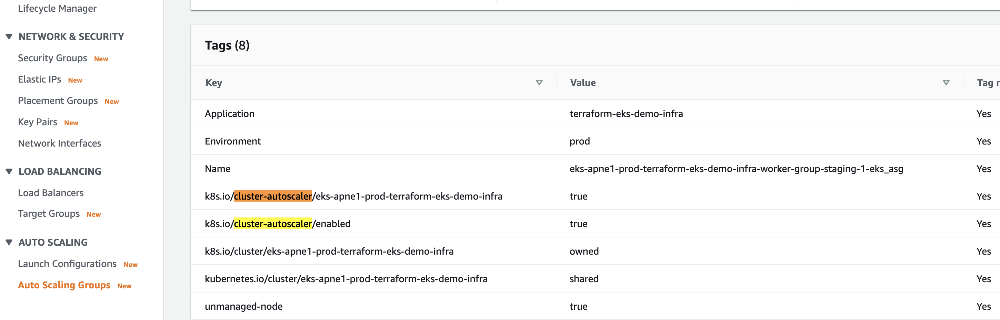
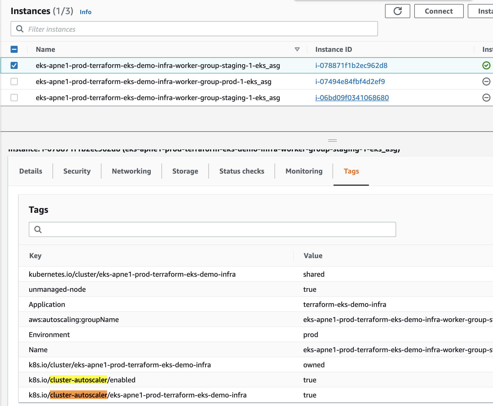
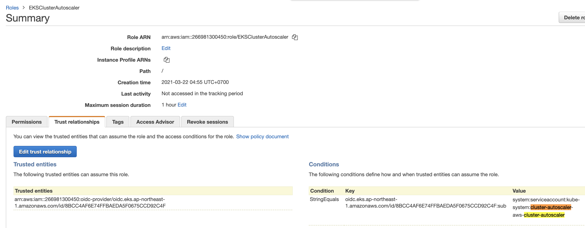
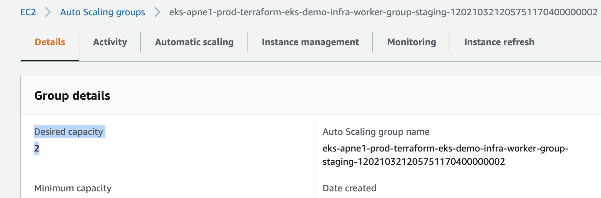
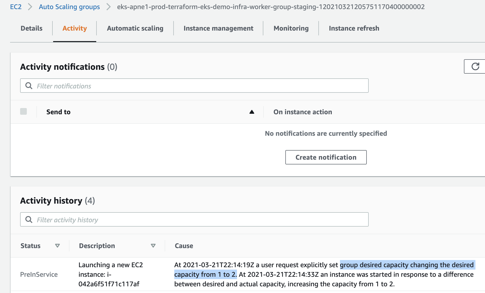

# Scale K8s worker nodes using Cluster Autoscaler (CA)


Cluster Autoscaler (CA) automatically adjusts the size of a Kubernetes Cluster so that all pods have a place to run and there are no unneeded nodes.

You need to configure three things:
1. set AWS ASG tags
2. create cluster-autoscaler resources in EKS cluster
3. set right IAM permission for cluster autoscaler by IRSA (per pod role) or by instance profile


# Step 1: (DONE in ch8) Configure K8s labels and taints
### 1.1 Use EKS Unmanaged Node Groups in favor of EKSCTL Managed Group for ability to configure taints & custom userdata


# Step 2: Enable Cluster Autoscaler auto-discovery 
- [Github Kubernetes Autoscaler: Enable Autoscaler's auto-discovery by tags](https://github.com/kubernetes/autoscaler/blob/master/cluster-autoscaler/cloudprovider/aws/README.md#auto-discovery-setup)
- [Github Terraform-aws-module: Add the required tags to the worker group](https://github.com/terraform-aws-modules/terraform-aws-eks/blob/master/docs/autoscaling.md)

For k8s cluster-autoscaler to auto-discover ASGs with nodes, you need to tag worker group by 
```
k8s.io/cluster-autoscaler/enabled
```
and
```
k8s.io/cluster-autoscaler/<YOUR CLUSTER NAME>
```

> It is recommended to use a second tag like k8s.io/cluster-autoscaler/<YOUR CLUSTER NAME> when k8s.io/cluster-autoscaler/enabled is used across many clusters to prevent ASGs from different clusters recognized as the node groups

In [eks-demo-infra/ap-northeast-1/prod/terraform.tfvars](eks-demo-infra/ap-northeast-1/prod/terraform.tfvars), add `k8s.io/cluster-autoscaler/enabled` to `tags` in `worker_groups` list's 1st map:
```sh
worker_groups = [
  {
    name                 = "worker-group-staging-1"
    instance_type        = "m3.medium" # since we are using AWS-VPC-CNI, allocatable pod IPs are defined by instance size: https://docs.google.com/spreadsheets/d/1MCdsmN7fWbebscGizcK6dAaPGS-8T_dYxWp0IdwkMKI/edit#gid=1549051942, https://github.com/awslabs/amazon-eks-ami/blob/master/files/eni-max-pods.txt
    asg_max_size         = 2
    asg_min_size         = 1
    asg_desired_capacity = 1 # this will be ignored if cluster autoscaler is enabled: asg_desired_capacity: https://github.com/terraform-aws-modules/terraform-aws-eks/blob/master/docs/autoscaling.md#notes
    kubelet_extra_args  = "--node-labels=env=staging,unmanaged-node=true --register-with-taints=staging-only=true:PreferNoSchedule" # for unmanaged nodes, taints and labels work only with extra-arg, not ASG tags. Ref: https://aws.amazon.com/blogs/opensource/improvements-eks-worker-node-provisioning/
    root_encrypted      = true
    tags = [
      {
        "key"                 = "unmanaged-node"
        "propagate_at_launch" = "true"
        "value"               = "true"
      },
      {
        "key"                 = "k8s.io/cluster-autoscaler/enabled" # <----- STEP 2
        "propagate_at_launch" = "true"
        "value"               = "true"
      },
    ]
```

In [eks-demo-infra/ap-northeast-1/prod/data.tf](eks-demo-infra/ap-northeast-1/prod/data.tf), add another tags to `eks_tags`:
```sh
locals {
  # note: "shared" tag needed for EKS to find VPC subnets by tags. Ref: https://docs.aws.amazon.com/eks/latest/userguide/network_reqs.html
  eks_tags = {
    Environment                                       = var.env
    Application                                       = var.app_name
    "kubernetes.io/cluster/${local.cluster_name}"     = "shared" # <----- STEP 2
    "k8s.io/cluster-autoscaler/${local.cluster_name}" = "true" # <----- STEP 2
  }
}
```

The reason why we define tag values from tfvars for input variable and local variable is because tfvars can't interpolate TF variable in `k8s.io/cluster-autoscaler/${local.cluster_name}`.


```sh
terraform apply


# output
  # module.eks.module.eks_cluster.data.template_file.userdata[0] will be read during apply
  # (config refers to values not yet known)
 <= data "template_file" "userdata"  {
      ~ id       = "e211f65e9dbd7cd8e8937e36fbcdf3cee4c512858b3239f236bbdcc9efa257f1" -> (known after apply)
      ~ rendered = <<-EOT
            #!/bin/bash -e
            
            # Allow user supplied pre userdata code
            
            
            # Bootstrap and join the cluster
            /etc/eks/bootstrap.sh --b64-cluster-ca 'xxx' --apiserver-endpoint 'https://8BCC4AF6E74FFBAEDA5F0675CCD92C4F.gr7.ap-northeast-1.eks.amazonaws.com'  --kubelet-extra-args "--node-labels=env=staging,unmanaged-node=true --register-with-taints=staging-only=true:PreferNoSchedule" 'eks-apne1-prod-terraform-eks-demo-infra'
            
            # Allow user supplied userdata code
        EOT -> (known after apply)
        # (2 unchanged attributes hidden)
    }

  # module.eks.module.eks_cluster.aws_autoscaling_group.workers[0] will be updated in-place
  ~ resource "aws_autoscaling_group" "workers" {
        id                        = "eks-apne1-prod-terraform-eks-demo-infra-worker-group-staging-120210321205751170400000002"
      ~ launch_configuration      = "eks-apne1-prod-terraform-eks-demo-infra-worker-group-staging-120210321205748510000000001" -> (known after apply)
        name                      = "eks-apne1-prod-terraform-eks-demo-infra-worker-group-staging-120210321205751170400000002"
        # (22 unchanged attributes hidden)

      + tag {
          + key                 = "k8s.io/cluster-autoscaler/eks-apne1-prod-terraform-eks-demo-infra"  # <---------CHANGED
          + propagate_at_launch = true
          + value               = "true"
        }
      + tag {
          + key                 = "k8s.io/cluster-autoscaler/enabled" # <---------CHANGED
          + propagate_at_launch = true
          + value               = "true"
        }
      + tag {
          + key                 = "kubernetes.io/cluster/eks-apne1-prod-terraform-eks-demo-infra" # <---------CHANGED
          + propagate_at_launch = true
          + value               = "shared"
        }
        # (6 unchanged blocks hidden)
    }

  # module.eks.module.eks_cluster.aws_cloudwatch_log_group.this[0] will be updated in-place
  ~ resource "aws_cloudwatch_log_group" "this" {
        id                = "/aws/eks/eks-apne1-prod-terraform-eks-demo-infra/cluster"
        name              = "/aws/eks/eks-apne1-prod-terraform-eks-demo-infra/cluster"
      ~ tags              = {
          + "k8s.io/cluster-autoscaler/eks-apne1-prod-terraform-eks-demo-infra" = "true"
          + "kubernetes.io/cluster/eks-apne1-prod-terraform-eks-demo-infra"     = "shared"
            # (2 unchanged elements hidden)
        }
        # (2 unchanged attributes hidden)
    }

  # module.eks.module.eks_cluster.aws_eks_cluster.this[0] will be updated in-place
  ~ resource "aws_eks_cluster" "this" {
        id                        = "eks-apne1-prod-terraform-eks-demo-infra"
        name                      = "eks-apne1-prod-terraform-eks-demo-infra"
      ~ tags                      = {
          + "k8s.io/cluster-autoscaler/eks-apne1-prod-terraform-eks-demo-infra" = "true"  # <---------CHANGED
          + "kubernetes.io/cluster/eks-apne1-prod-terraform-eks-demo-infra"     = "shared"  # <---------CHANGED
            # (2 unchanged elements hidden)
        }
        # (10 unchanged attributes hidden)


        # (4 unchanged blocks hidden)
    }

  # module.eks.module.eks_cluster.aws_iam_role.cluster[0] will be updated in-place
  ~ resource "aws_iam_role" "cluster" {
        id                    = "eks-apne1-prod-terraform-eks-de20210321183200998600000004"
        name                  = "eks-apne1-prod-terraform-eks-de20210321183200998600000004"
      ~ tags                  = {
          + "k8s.io/cluster-autoscaler/eks-apne1-prod-terraform-eks-demo-infra" = "true"
          + "kubernetes.io/cluster/eks-apne1-prod-terraform-eks-demo-infra"     = "shared"
            # (2 unchanged elements hidden)
        }
        # (9 unchanged attributes hidden)

        # (1 unchanged block hidden)
    }

  # module.eks.module.eks_cluster.aws_iam_role.workers[0] will be updated in-place
  ~ resource "aws_iam_role" "workers" {
        id                    = "eks-apne1-prod-terraform-eks-de2021032118435120210000000f"
        name                  = "eks-apne1-prod-terraform-eks-de2021032118435120210000000f"
      ~ tags                  = {
          + "k8s.io/cluster-autoscaler/eks-apne1-prod-terraform-eks-demo-infra" = "true"
          + "kubernetes.io/cluster/eks-apne1-prod-terraform-eks-demo-infra"     = "shared"
            # (2 unchanged elements hidden)
        }
        # (9 unchanged attributes hidden)

        # (1 unchanged block hidden)
    }

  # module.eks.module.eks_cluster.aws_launch_configuration.workers[0] must be replaced
+/- resource "aws_launch_configuration" "workers" {
      ~ arn                              = "arn:aws:autoscaling:ap-northeast-1:266981300450:launchConfiguration:681506f3-97c2-4bc9-bb6a-55a7cdd686dd:launchConfigurationName/eks-apne1-prod-terraform-eks-demo-infra-worker-group-staging-120210321205748510000000001" -> (known after apply)
      ~ id                               = "eks-apne1-prod-terraform-eks-demo-infra-worker-group-staging-120210321205748510000000001" -> (known after apply)
      + key_name                         = (known after apply)
      ~ name                             = "eks-apne1-prod-terraform-eks-demo-infra-worker-group-staging-120210321205748510000000001" -> (known after apply)
      ~ user_data_base64                 = "xxx" -> (known after apply) # forces replacement
      - vpc_classic_link_security_groups = [] -> null
        # (8 unchanged attributes hidden)

      + ebs_block_device {
          + delete_on_termination = (known after apply)
          + device_name           = (known after apply)
          + encrypted             = (known after apply)
          + iops                  = (known after apply)
          + no_device             = (known after apply)
          + snapshot_id           = (known after apply)
          + volume_size           = (known after apply)
          + volume_type           = (known after apply)
        }

      + metadata_options {
          + http_endpoint               = (known after apply)
          + http_put_response_hop_limit = (known after apply)
          + http_tokens                 = (known after apply)
        }

        # (1 unchanged block hidden)
    }

  # module.eks.module.eks_cluster.aws_security_group.cluster[0] will be updated in-place
  ~ resource "aws_security_group" "cluster" {
        id                     = "sg-032221e2c56374acf"
        name                   = "eks-apne1-prod-terraform-eks-demo-infra2021032118323698280000000d"
      ~ tags                   = {
          + "k8s.io/cluster-autoscaler/eks-apne1-prod-terraform-eks-demo-infra" = "true"
          + "kubernetes.io/cluster/eks-apne1-prod-terraform-eks-demo-infra"     = "shared"
            # (3 unchanged elements hidden)
        }
        # (8 unchanged attributes hidden)
    }

  # module.eks.module.eks_cluster.aws_security_group.workers[0] will be updated in-place
  ~ resource "aws_security_group" "workers" {
        id                     = "sg-0c519562d636926da"
        name                   = "eks-apne1-prod-terraform-eks-demo-infra2021032118323703320000000e"
      ~ tags                   = {
          + "k8s.io/cluster-autoscaler/eks-apne1-prod-terraform-eks-demo-infra" = "true"
            # (4 unchanged elements hidden)
        }
        # (8 unchanged attributes hidden)
    }

  # module.eks.module.eks_cluster.random_pet.workers[0] must be replaced
+/- resource "random_pet" "workers" {
      ~ id        = "generous-coyote" -> (known after apply)
      ~ keepers   = {
          - "lc_name" = "eks-apne1-prod-terraform-eks-demo-infra-worker-group-staging-120210321205748510000000001"
        } -> (known after apply) # forces replacement
        # (2 unchanged attributes hidden)
    }

  # module.eks.module.eks_node_ebs_kms_key.aws_kms_key.this will be updated in-place
  ~ resource "aws_kms_key" "this" {
        id                       = "292c4edb-f9b9-4f2c-aa39-175f1a404e68"
      ~ tags                     = {
          + "k8s.io/cluster-autoscaler/eks-apne1-prod-terraform-eks-demo-infra" = "true"
          + "kubernetes.io/cluster/eks-apne1-prod-terraform-eks-demo-infra"     = "shared"
            # (3 unchanged elements hidden)
        }
        # (9 unchanged attributes hidden)
    }

  # module.eks.module.k8s_secret_kms_key.aws_kms_key.this will be updated in-place
  ~ resource "aws_kms_key" "this" {
        id                       = "31d1604a-8a26-4d75-aa37-9e659a59ac23"
      ~ tags                     = {
          + "k8s.io/cluster-autoscaler/eks-apne1-prod-terraform-eks-demo-infra" = "true"
          + "kubernetes.io/cluster/eks-apne1-prod-terraform-eks-demo-infra"     = "shared"
            # (3 unchanged elements hidden)
        }
        # (9 unchanged attributes hidden)
    }

Plan: 2 to add, 9 to change, 2 to destroy.
```

Auto Scaling Group tags:



Restart EC2 to spin up a new one with the updated Launch Config that contains tags for cluster autoscaler




# Step 3: Attach IAM role (for ASG) to Cluster Autoscaler via IRSA 

## 3.1 Create assumable IAM role with trust relationship with service account and IAM role

In [composition/eks-demo-infra/ap-northeast-1/prod/terraform.tfvars](composition/eks-demo-infra/ap-northeast-1/prod/terraform.tfvars),
```sh
cluster_autoscaler_service_account_namespace           = "kube-system"
cluster_autoscaler_service_account_name                = "cluster-autoscaler-aws-cluster-autoscaler"
```

In [composition/eks-demo-infra/ap-northeast-1/prod/main.tf](composition/eks-demo-infra/ap-northeast-1/prod/main.tf),
```sh
########################################
# EKS
########################################
module "eks" {
  source = "../../../../infrastructure_modules/eks"

  ## EKS ##
  create_eks      = var.create_eks
  cluster_version = var.cluster_version
  cluster_name    = local.cluster_name
  vpc_id          = local.vpc_id
  subnets         = local.private_subnets

  # note: either pass worker_groups or node_groups
  # this is for (EKSCTL API) unmanaged node group
  worker_groups = var.worker_groups

  # this is for (EKS API) managed node group
  node_groups = var.node_groups

  # add roles that can access K8s cluster
  map_roles = local.map_roles

  # specify AWS Profile if you want kubectl to use a named profile to authenticate instead of access key and secret access key
  kubeconfig_aws_authenticator_env_variables = local.kubeconfig_aws_authenticator_env_variables

  ## IRSA (IAM role for service account) ##
  enable_irsa                                  = var.enable_irsa
  test_irsa_service_account_namespace                = "default"
  test_irsa_service_account_name                     = "test-irsa"
  cluster_autoscaler_service_account_namespace = var.cluster_autoscaler_service_account_namespace # <------ STEP 3
  cluster_autoscaler_service_account_name      = var.cluster_autoscaler_service_account_name
```


In [composition/eks-demo-infra/ap-northeast-1/prod/variables.tf](composition/eks-demo-infra/ap-northeast-1/prod/variables.tf), define `cluster_autoscaler_service_account_namespace` and `cluster_autoscaler_service_account_name` input variables
```sh
variable "cluster_autoscaler_service_account_namespace" {
  description = "K8s namespace under which service account exists"
}
variable "cluster_autoscaler_service_account_name" {
  description = "K8s service account (on behalf of pods) to allow assuming AWS IAM role through OIDC via AWS STS"
}
```


In [infrastructure_modules/eks/main.tf](infrastructure_modules/eks/main.tf), define two modules
```sh
# IRSA ##
module "cluster_autoscaler_iam_assumable_role" {
  source = "../../resource_modules/identity/iam/iam-assumable-role-with-oidc"

  create_role                   = var.create_eks ? true : false
  role_name                     = local.cluster_autoscaler_iam_role_name
  provider_url                  = replace(module.eks_cluster.cluster_oidc_issuer_url, "https://", "")
  role_policy_arns              = [module.cluster_autoscaler_iam_policy.arn]
  oidc_fully_qualified_subjects = ["system:serviceaccount:${var.cluster_autoscaler_service_account_namespace}:${var.cluster_autoscaler_service_account_name}"] # <------- IRSA for Cluster Autoscaler pod by specifying namespace and service account 
}

module "cluster_autoscaler_iam_policy" {
  source = "../../resource_modules/identity/iam/policy"

  create_policy = var.create_eks ? true : false
  description   = local.cluster_autoscaler_iam_policy_description
  name          = local.cluster_autoscaler_iam_policy_name
  path          = local.cluster_autoscaler_iam_policy_path
  policy        = data.aws_iam_policy_document.cluster_autoscaler.json
}
```


In [infrastructure_modules/eks/data.tf](infrastructure_modules/eks/data.tf), define local variables and data resource for IAM policy document containing AWS ASG related permissions Cluster Autoscaler needs to scale in/out:
```sh
locals {
  ## cluster_autoscaler_iam_role ##
  cluster_autoscaler_iam_role_name = "EKSClusterAutoscaler"

  ## cluster_autoscaler_iam_policy ##
  cluster_autoscaler_iam_policy_description = "EKS cluster-autoscaler policy for cluster ${module.eks_cluster.cluster_id}"
  cluster_autoscaler_iam_policy_name        = "${local.cluster_autoscaler_iam_role_name}Policy"
  cluster_autoscaler_iam_policy_path        = "/"
}

data "aws_iam_policy_document" "cluster_autoscaler" {
  statement {
    sid    = "clusterAutoscalerAll"
    effect = "Allow"

    actions = [
      "autoscaling:DescribeAutoScalingGroups",
      "autoscaling:DescribeAutoScalingInstances",
      "autoscaling:DescribeLaunchConfigurations",
      "autoscaling:DescribeTags",
      "ec2:DescribeLaunchTemplateVersions",
    ]

    resources = ["*"]
  }

  statement {
    sid    = "clusterAutoscalerOwn"
    effect = "Allow"

    actions = [
      "autoscaling:SetDesiredCapacity",
      "autoscaling:TerminateInstanceInAutoScalingGroup",
      "autoscaling:UpdateAutoScalingGroup",
    ]

    resources = ["*"]

    # limit who can assume the role
    # ref: https://docs.aws.amazon.com/eks/latest/userguide/iam-roles-for-service-accounts-technical-overview.html
    # ref: https://www.terraform.io/docs/providers/aws/r/eks_cluster.html#enabling-iam-roles-for-service-accounts

    condition {
      test     = "StringEquals"
      variable = "autoscaling:ResourceTag/kubernetes.io/cluster/${module.eks_cluster.cluster_id}" # <------- specifying ASG by tag we added in STEP 1
      values   = ["shared"]
    }

    condition {
      test     = "StringEquals"
      variable = "autoscaling:ResourceTag/k8s.io/cluster-autoscaler/enabled" # <------- specifying ASG by tag we added in STEP 1
      values   = ["true"]
    }
  }
}
```


In [infrastructure_modules/eks/variables.tf](infrastructure_modules/eks/variables.tf), define input variables in infra layer
```sh
## IRSA & cluster autoscaler ##
variable "cluster_autoscaler_service_account_namespace" {
  description = "K8s namespace under which service account exists"
}

variable "cluster_autoscaler_service_account_name" {
  description = "K8s service account (on behalf of pods) to allow assuming AWS IAM role through OIDC via AWS STS"
}
```


```sh
# download modules
terraform init -backend-config=backend.config

terraform apply

# plan output
# module.eks.module.cluster_autoscaler_iam_assumable_role.aws_iam_role.this[0] will be created
  + resource "aws_iam_role" "this" {
      + arn                   = (known after apply)
      + assume_role_policy    = jsonencode(
            {
              + Statement = [
                  + {
                      + Action    = "sts:AssumeRoleWithWebIdentity"
                      + Condition = {
                          + StringEquals = {
                              + oidc.eks.ap-northeast-1.amazonaws.com/id/8BCC4AF6E74FFBAEDA5F0675CCD92C4F:sub = [
                                  + "system:serviceaccount:kube-system:cluster-autoscaler-aws-cluster-autoscaler",
                                ]
                            }
                        }
                      + Effect    = "Allow"
                      + Principal = {
                          + Federated = "arn:aws:iam::266981300450:oidc-provider/oidc.eks.ap-northeast-1.amazonaws.com/id/8BCC4AF6E74FFBAEDA5F0675CCD92C4F"
                        }
                      + Sid       = ""
                    },
                ]
              + Version   = "2012-10-17"
            }
        )
      + create_date           = (known after apply)
      + force_detach_policies = false
      + id                    = (known after apply)
      + managed_policy_arns   = (known after apply)
      + max_session_duration  = 3600
      + name                  = "EKSClusterAutoscaler"
      + path                  = "/"
      + unique_id             = (known after apply)

      + inline_policy {
          + name   = (known after apply)
          + policy = (known after apply)
        }
    }

  # module.eks.module.cluster_autoscaler_iam_assumable_role.aws_iam_role_policy_attachment.custom[0] will be created
  + resource "aws_iam_role_policy_attachment" "custom" {
      + id         = (known after apply)
      + policy_arn = (known after apply)
      + role       = "EKSClusterAutoscaler"
    }

  # module.eks.module.cluster_autoscaler_iam_policy.aws_iam_policy.this[0] will be created
  + resource "aws_iam_policy" "this" {
      + arn         = (known after apply)
      + description = "EKS cluster-autoscaler policy for cluster eks-apne1-prod-terraform-eks-demo-infra"
      + id          = (known after apply)
      + name        = "EKSClusterAutoscalerPolicy"
      + path        = "/"
      + policy      = jsonencode(
            {
              + Statement = [
                  + {
                      + Action   = [
                          + "ec2:DescribeLaunchTemplateVersions",
                          + "autoscaling:DescribeTags",
                          + "autoscaling:DescribeLaunchConfigurations",
                          + "autoscaling:DescribeAutoScalingInstances",
                          + "autoscaling:DescribeAutoScalingGroups",
                        ]
                      + Effect   = "Allow"
                      + Resource = "*"
                      + Sid      = "clusterAutoscalerAll"
                    },
                  + {
                      + Action    = [
                          + "autoscaling:UpdateAutoScalingGroup",
                          + "autoscaling:TerminateInstanceInAutoScalingGroup",
                          + "autoscaling:SetDesiredCapacity",
                        ]
                      + Condition = {
                          + StringEquals = {
                              + autoscaling:ResourceTag/k8s.io/cluster-autoscaler/enabled                             = [
                                  + "true",
                                ]
                              + autoscaling:ResourceTag/kubernetes.io/cluster/eks-apne1-prod-terraform-eks-demo-infra = [
                                  + "shared",
                                ]
                            }
                        }
                      + Effect    = "Allow"
                      + Resource  = "*"
                      + Sid       = "clusterAutoscalerOwn"
                    },
                ]
              + Version   = "2012-10-17"
            }
        )
    }

  # module.eks.module.eks_cluster.aws_autoscaling_group.workers[0] will be updated in-place
  ~ resource "aws_autoscaling_group" "workers" {
        id                        = "eks-apne1-prod-terraform-eks-demo-infra-worker-group-staging-120210321205751170400000002"
        name                      = "eks-apne1-prod-terraform-eks-demo-infra-worker-group-staging-120210321205751170400000002"
        # (23 unchanged attributes hidden)

      + tag {
          + key                 = "kubernetes.io/cluster/eks-apne1-prod-terraform-eks-demo-infra"
          + propagate_at_launch = true
          + value               = "owned"
        }
        # (8 unchanged blocks hidden)
    }

Plan: 3 to add, 1 to change, 0 to destroy.
```




# Step 4: Deploy Cluster Autoscaler in EKS cluster using Helm chart

Helm chart:
- (obsolete) https://github.com/helm/charts/tree/master/stable/cluster-autoscaler
- (new, requiring K8s 1.8+) https://github.com/kubernetes/autoscaler/tree/master/charts/cluster-autoscaler
 

In [overrides.yaml](overrides.yaml), it defines `rbac.serviceAccount.annotations` (IAM role for Cluster Autoscaler we created in STEP 3), `autoDiscovery.clusterName`, and `autoDiscovery.enabled`:
```yaml
awsRegion: ap-northeast-1 # <----- change this to your region!

rbac:
  create: true
  serviceAccount:
    annotations: # ref: https://github.com/kubernetes/autoscaler/tree/master/charts/cluster-autoscaler#aws---iam-roles-for-service-accounts-irsa
      eks.amazonaws.com/role-arn: "arn:aws:iam::266981300450:role/EKSClusterAutoscaler" # <----- copy your IAM role ARN!

autoDiscovery:
  clusterName: eks-apne1-prod-terraform-eks-demo-infra # <----- change this to your cluster name!
  enabled: true

# usage
# helm repo add autoscaler https://kubernetes.github.io/autoscaler
# helm install cluster-autoscaler     autoscaler/cluster-autoscaler     --namespace kube-system     --values overrides.yaml
```

Save configs in yamls
```sh
# export AWS_PROFILE
export AWS_PROFILE=aws-demo

# set KUBECONFIG
export KUBECONFIG="${PWD}/kubeconfig_eks-apne1-prod-terraform-eks-demo-infra"

# test k8s authentication
kubectl get pod
No resources found in default namespace.

cd ../../../../
# test k8s authentication
kubectl get pod
No resources found in default namespace.


helm repo add autoscaler https://kubernetes.github.io/autoscaler

# name must be "cluster-autoscaler" because service account to be created will depend on this chart name, and we already set it to `cluster_autoscaler_service_account_name        = "cluster-autoscaler-aws-cluster-autoscaler"` in terraform.tfvars
# optional: save interpolated k8s objects in yaml
helm install cluster-autoscaler \
    autoscaler/cluster-autoscaler \
    --namespace kube-system \
    --values overrides.yaml \
    --dry-run \
    -o yaml > ca.yaml

# optional: save default values.yaml
helm show values autoscaler/cluster-autoscaler > values.yaml
```


After checking yamls, install it
```sh
# you could pull helm chart to local to lock in the version
helm pull autoscaler/cluster-autoscaler

helm install cluster-autoscaler \
    autoscaler/cluster-autoscaler \
    --namespace kube-system \
    --values overrides.yaml
```

Output
```sh
NAME: cluster-autoscaler
LAST DEPLOYED: Mon Mar 22 05:03:33 2021
NAMESPACE: kube-system
STATUS: deployed
REVISION: 1
TEST SUITE: None
NOTES:
To verify that cluster-autoscaler has started, run:

  kubectl --namespace=kube-system get pods -l "app.kubernetes.io/name=aws-cluster-autoscaler,app.kubernetes.io/instance=cluster-autoscaler"
```

Ensure the cluster-autoscaler pod is running:
```sh
kubectl --namespace=kube-system get pods -l "app.kubernetes.io/name=aws-cluster-autoscaler,app.kubernetes.io/instance=cluster-autoscaler"
NAME                                                        READY   STATUS    RESTARTS   AGE
cluster-autoscaler-aws-cluster-autoscaler-d6dc94f6c-7bmjx   1/1     Running   0          62s
```

Check service account name created is `cluster-autoscaler-aws-cluster-autoscaler`
```sh
kubectl get sa -n kube-system

NAME                                        SECRETS   AGE
cluster-autoscaler-aws-cluster-autoscaler   1         107s
```


# Step 5: Test Cluster Autoscaler IAM role

In [test_ca_irsa_pod.yaml](test_ca_rsa_pod.yaml),
```yaml
apiVersion: v1
kind: Pod
metadata:
  name: test-irsa
  namespace: kube-system # <----- namespace must be kube-system as defined in terraform.tfvars
spec:
  serviceAccountName: cluster-autoscaler-aws-cluster-autoscaler # <----- use this SA name
  containers:
  - image: amazon/aws-cli
    name: test-irsa
    command:
    - sleep
    - "1500"
```

Start a pod
```sh
kubectl apply -f test_ca_irsa_pod.yaml

# make sure pod is running
kubectl get pod test-irsa -n kube-system

kubectl exec -it test-irsa -n kube-system sh
```

Verify envs are injected
```sh
env | grep AWS

# expected output
AWS_ROLE_ARN=arn:aws:iam::xxxx:role/EKSClusterAutoscaler # <------- this
AWS_WEB_IDENTITY_TOKEN_FILE=/var/run/secrets/eks.amazonaws.com/serviceaccount/token # <------- this
CLUSTER_AUTOSCALER_AWS_CLUSTER_AUTOSCALER_SERVICE_PORT=8085
CLUSTER_AUTOSCALER_AWS_CLUSTER_AUTOSCALER_PORT_8085_TCP_ADDR=172.20.132.165
CLUSTER_AUTOSCALER_AWS_CLUSTER_AUTOSCALER_PORT_8085_TCP_PORT=8085
CLUSTER_AUTOSCALER_AWS_CLUSTER_AUTOSCALER_SERVICE_PORT_HTTP=8085
AWS_DEFAULT_REGION=ap-northeast-1
CLUSTER_AUTOSCALER_AWS_CLUSTER_AUTOSCALER_PORT_8085_TCP=tcp://172.20.132.165:8085
AWS_REGION=ap-northeast-1
CLUSTER_AUTOSCALER_AWS_CLUSTER_AUTOSCALER_PORT=tcp://172.20.132.165:8085
CLUSTER_AUTOSCALER_AWS_CLUSTER_AUTOSCALER_SERVICE_HOST=172.20.132.165
CLUSTER_AUTOSCALER_AWS_CLUSTER_AUTOSCALER_PORT_8085_TCP_PROTO=tcp
```

`AWS_WEB_IDENTITY_TOKEN_FILE` is owned by root but because of added `fsgroup` under `securityContext`, non-root user can read it
```
$ ls -ls /var/run/secrets/eks.amazonaws.com/serviceaccount/token
0 lrwxrwxrwx 1 root root 12 Apr 29 18:42 /var/run/secrets/eks.amazonaws.com/serviceaccount/token -> ..data/token

$ whoami
root

$ id
uid=0(root) gid=0(root) groups=0(root)

$ cat /var/run/secrets/eks.amazonaws.com/serviceaccount/token
```

Verify a pod has permissions for ASG
```sh
# make sure to change AWS region to yours
aws autoscaling describe-auto-scaling-instances --region ap-northeast-1

# successful output
{
    "AutoScalingInstances": [
        {
            "InstanceId": "i-xxxxx",
            "InstanceType": "m3.medium",
            "AutoScalingGroupName": "eks-apne1-prod-terraform-eks-demo-infra-worker-group-staging-120210321205751170400000002",
            "AvailabilityZone": "ap-northeast-1c",
            "LifecycleState": "InService",
            "HealthStatus": "HEALTHY",
            "LaunchConfigurationName": "eks-apne1-prod-terraform-eks-demo-infra-worker-group-staging-120210321212453319100000001",
            "ProtectedFromScaleIn": false
        }
    ]
}
```


Test another ASG permission for autoscaling
```sh
# make sure to change AWS region and "auto-scaling-group-name" to yours based on the previous output
aws autoscaling set-desired-capacity \
    --auto-scaling-group-name eks-apne1-prod-terraform-eks-demo-infra-worker-group-staging-120210321205751170400000002 \
    --desired-capacity 2 \
    --region ap-northeast-1

# check from AWS EC2 ASG console if desired capacity is updated
```






Test this pod associated with serviceaccount `cluster-autoscaler-aws-cluster-autoscaler` doesn't have permission for S3 
```sh
$ aws s3 ls

# expected output
An error occurred (AccessDeniedException) when calling the aws s3 ls operation: 
```


# Step 6: Install Metrics Server first
```
kubectl apply -f https://github.com/kubernetes-sigs/metrics-server/releases/download/v0.3.6/components.yaml
```

Check metrics-server deployment
```bash
kubectl get deployment metrics-server -n kube-system
```

Output
```bash
NAME             READY   UP-TO-DATE   AVAILABLE   AGE
metrics-server   1/1     1            1           82s
```


# Step 7. Test K8s worker nodes autoscale based on demands

First deploy nginx pod
```
kubectl create namespace test
kubectl apply -f test_scaling.yaml
```

Check deployment and pod
```
kubectl get deploy -n test
kubectl get pod -n test -o wide
```

Check worker node's allocated resouce
```
kubectl top node
kubectl describe node ip-10-1-103-244.ec2.internal
```

Output
```sh
Allocated resources:
  (Total limits may be over 100 percent, i.e., overcommitted.)
  Resource                    Requests     Limits
  --------                    --------     ------
  cpu                         910m (47%)   2500m (129%)
  memory                      852Mi (15%)  1052Mi (18%)
  ephemeral-storage           0 (0%)       0 (0%)
  attachable-volumes-aws-ebs  0            0
```

You see CPU limit is `2500m` and memory limit is `1052Mi`.

Scale nginx deployment to 10 
```
kubectl scale --replicas=10 deployment/test-scaling -n test
```

Check status of pod
```sh
kubectl get pod -n test
NAME                                READY   STATUS    RESTARTS   AGE
test_scaling-98ffcf4f7-2skcx   0/1     Pending   0          42s
test_scaling-98ffcf4f7-5wsgn   0/1     Pending   0          42s
test_scaling-98ffcf4f7-99gmv   0/1     Pending   0          42s
test_scaling-98ffcf4f7-hw57s   0/1     Pending   0          42s
test_scaling-98ffcf4f7-lmq6l   0/1     Pending   0          42s
test_scaling-98ffcf4f7-n5hss   1/1     Running   0          42s
test_scaling-98ffcf4f7-rp9ng   1/1     Running   0          5m11s
test_scaling-98ffcf4f7-rzdtj   1/1     Running   0          42s
test_scaling-98ffcf4f7-scpb8   0/1     Pending   0          42s
test_scaling-98ffcf4f7-wt2vf   0/1     Pending   0          42s
```

Check events of pending pod
```
kubectl describe pod test_scaling-5b9dfddc87-ttnrt -n test
```

Output should show `pod triggered scale-up`
```sh
Events:
  Type     Reason            Age                From                Message
  ----     ------            ----               ----                -------
  Warning  FailedScheduling  52s (x2 over 52s)  default-scheduler   0/3 nodes are available: 1 node(s) didn't match node selector, 2 Insufficient cpu.
  Normal   TriggeredScaleUp  51s                cluster-autoscaler  pod triggered scale-up: [{eks-ue1-prod-organization_name-api-infra-worker-group-staging-120200507173038542300000005 2->3 (max: 3)}]
```

You see 
```sh
0/3 nodes are available: 1 node(s) didn't match node selector, 2 Insufficient cpu.
```

And
```sh
pod triggered scale-up: [{eks-ue1-prod-organization_name-api-infra-worker-group-staging-120200507173038542300000005 2->3 (max: 3)}]
```

View clusterautoscaler logs
```
kubectl logs deployment/cluster-autoscaler-aws-cluster-autoscaler -n kube-system
```

Output should show you that staging node group should be able to scale up up to the max size limit as in `1 max node group size reached`
```sh
I0507 18:12:18.872668       1 scale_up.go:348] Skipping node group eks-ue1-prod-organization_name-api-infra-worker-group-staging-120200507173038542300000005 - max size reached

I0507 18:12:18.873470       1 static_autoscaler.go:439] Scale down status: unneededOnly=true lastScaleUpTime=2020-05-07 18:10:18.182849499 +0000 UTC m=+2290.588530135 lastScaleDownDeleteTime=2020-05-07 17:32:28.323356185 +0000 UTC m=+20.729036698 lastScaleDownFailTime=2020-05-07 17:32:28.323357798 +0000 UTC m=+20.729038331 scaleDownForbidden=false isDeleteInProgress=false scaleDownInCooldown=true
I0507 18:12:18.873897       1 event.go:281] Event(v1.ObjectReference{Kind:"Pod", Namespace:"test", Name:"test_scaling-7499fc797-r8dsz", UID:"7bf9bd56-2f73-417e-9949-7722b0df5772", APIVersion:"v1", ResourceVersion:"270633", FieldPath:""}): type: 'Normal' reason: 'NotTriggerScaleUp' pod didn't trigger scale-up (it wouldn't fit if a new node is added): 1 node(s) didn't match node selector, 1 max node group size reached
```


### Clean up
```
kubectl scale --replicas=0 deployment/test-scaling -n test
kubectl delete deploy test-scaling -n test

kubectl delete -f test_scaling.yaml
kubectl delete -f test_irsa.yaml
```


## Refs
[Github Kubernetes ClusterAutoscaler](https://github.com/kubernetes/autoscaler/blob/master/cluster-autoscaler/FAQ.md#what-types-of-pods-can-prevent-ca-from-removing-a-node)

### How does scale-up work?
Scale-up creates a watch on the API server looking for all pods. It checks for any unschedulable pods every 10 seconds (configurable by --scan-interval flag). A pod is unschedulable when the Kubernetes scheduler is unable to find a node that can accommodate the pod. For example, a pod can request more CPU that is available on any of the cluster nodes. Unschedulable pods are recognized by their PodCondition. Whenever a Kubernetes scheduler fails to find a place to run a pod, it sets "schedulable" PodCondition to false and reason to "unschedulable". If there are any items in the unschedulable pods list, Cluster Autoscaler tries to find a new place to run them.

It is assumed that the underlying cluster is run on top of some kind of node groups. Inside a node group, all machines have identical capacity and have the same set of assigned labels. Thus, increasing a size of a node group will create a new machine that will be similar to these already in the cluster - they will just not have any user-created pods running (but will have all pods run from the node manifest and daemon sets.)

Based on the above assumption, Cluster Autoscaler creates template nodes for each of the node groups and checks if any of the unschedulable pods would fit on a new node. While it may sound similar to what the real scheduler does, it is currently quite simplified and may require multiple iterations before all of the pods are eventually scheduled. If there are multiple node groups that, if increased, would help with getting some pods running, different strategies can be selected for choosing which node group is increased. Check What are Expanders? section to learn more about strategies.

It may take some time before the created nodes appear in Kubernetes. It almost entirely depends on the cloud provider and the speed of node provisioning. Cluster Autoscaler expects requested nodes to appear within 15 minutes (configured by --max-node-provision-time flag.) After this time, if they are still unregistered, it stops considering them in simulations and may attempt to scale up a different group if the pods are still pending. It will also attempt to remove any nodes left unregistered after this time.

### How fast is Cluster Autoscaler?

> By default, scale-up is considered up to 10 seconds after pod is marked as unschedulable, and scale-down 10 minutes after a node becomes unneeded. There are multiple flags which can be used to configure these thresholds. For example, in some environments, you may wish to give the k8s scheduler a bit more time to schedule a pod than the CA's scan-interval. One way to do this is by setting --new-pod-scale-up-delay, which causes the CA to ignore unschedulable pods until they are a certain "age", regardless of the scan-interval. If k8s has not scheduled them by the end of that delay, then they may be considered by the CA for a possible scale-up.

### How fast is HPA when combined with CA?
When HPA is combined with CA, the total time from increased load to new pods running is determined by three major factors:
- HPA reaction time,
- CA reaction time,
- node provisioning time.

By default, pods' CPU usage is scraped by kubelet every 10 seconds, and it is obtained from kubelet by Metrics Server every 1 minute. HPA checks CPU load metrics in Metrics Server every 30 seconds. However, after changing the number of replicas, HPA backs off for 3 minutes before taking further action. So it can be up to 3 minutes before pods are added or deleted, but usually it's closer to 1 minute.

CA should react as fast as described here, regardless of whether it was HPA or the user that modified the number of replicas. For scale-up, we expect it to be less than 30 seconds in most cases.

Node provisioning time depends mostly on cloud provider. In our experience, on GCE it usually takes 3 to 4 minutes from CA request to when pods can be scheduled on newly created nodes.

Total time is a sum of those steps, and it's usually about 5 minutes. Please note that CA is the least significant factor here.

On the other hand, for scale-down CA is usually the most significant factor, as it doesn't attempt to remove nodes immediately, but only after they've been unneeded for a certain time.

### Gotchas
No min/max values are provided when using Auto-Discovery, cluster-autoscaler will respect the current min and max values of the ASG being targeted, and it will __adjust only the "desired" value__.