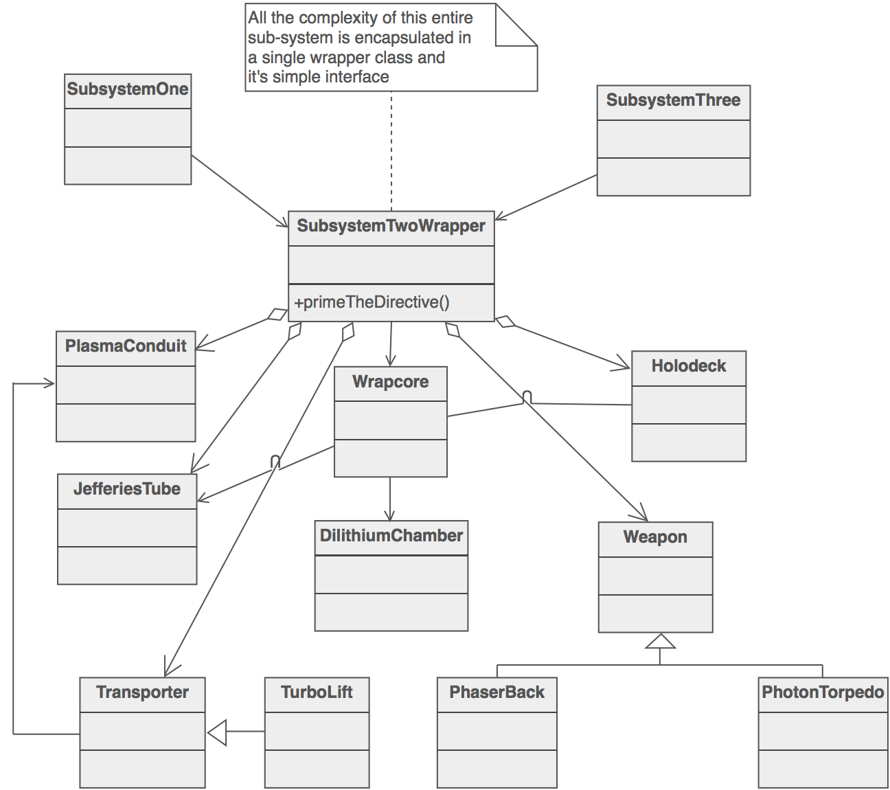

# Using 3-layered approach to Terraform (HIGHLY ADVANCED)
Ref: https://www.terraform-best-practices.com/key-concepts

Think about these scenarios:
1) want to create a bastion EC2, create IAM role and instance profile and security group to attach to EC2, and store its private IP in SSM parameter store
2) want to create ALB, and register its DNS name in R53 A record
3) want to create RDS, and encrypt data at rest using a custom AWS KMS key
4) want to create VPC, and also VPC peering and AWS Client VPN


For all of the 1)-4), we can store `*.tf` for each Terraform AWS modules (EC2, VPC, Route53, etc) inside `modules/` dir as in `2.1_naive_terraform_modules/`:
```sh
.
├── modules # <------ modules are organized under this dir
│   ├── compute
│   │   ├── ec2
│   │   ├── ec2_key_pair
│   │   ├── security_group
│   │   └── ssm
│   ├── network
│   │   ├── route53
│   │   │   ├── hosted_zone
│   │   │   └── record
│   │   └── vpc
│   └── storage
│       ├── dynamodb
│       ├── efs
│       └── s3
```


## Don't Break Single Class Resposibility Principle
Based on single class responsibility principle, you shouldn't mix IAM role and security group resources in `modules/compute/ec2/main.tf` file. 

```sh
.
├── modules 
│   ├── compute
│   │   ├── ec2 # <----- you shouldn't add IAM role and SG in EC2's main.tf
```


## Don't Break Abstraction and Encapsulation (main() shouldn't be nosy)

How about adding them in `us-east-1/prod/main.tf`? That means everytime you want to create new AWS resources, you will be appending to `us-east-1/prod/main.tf`, hence the `main.tf` file gets bigger and less modularized, less manageable.

```sh
── us-east-1 
│   ├── prod
│   │   ├── backend.config
│   │   ├── main.tf # <----- add IAM role and SG for bastion and app servers here respectively?
```


Usually main() should be as simple and short as possible. If we keep adding multiple EC2, multiple security groups, multiople IAM roles, multiple R53 A records in `us-east-1.prod.main.tf`, it'll look like this, which won't be modularized and not cohesive based around AWS resources
```sh
# in /us-east-1/prod/main.tf

module "bastion_ec2" {
  source = "./modules/ec2/"
}

module "app_ec2" {
  source = "./modules/ec2/"
}

module "bastion_security_group" {}

module "app_security_group" {}

module "bastion_private_ip" {}

module "app_private_ip" {}

module "elb_a_record" {}

module "rds_kms_key" {}

# keep adding more and more
.
.
.
```

This goes against keeping one `.tf` file short and simple

> separate unrelated resources from each other by placing them in separate compositions reduces the risk if something goes wrong


## Use Class-like infra-module to Abstract Away details (main() shouldn't be nosy)


So intead, you should be wrapping resource modules with another modules (infra module) to group resources together. 

This abstraction layer is similar to __[Facade pattern](https://sourcemaking.com/design_patterns/facade)__, meaning a class wrapping bunch of classes to create a simple interface to a client:



> - Provide a unified interface to a set of interfaces in a subsystem. Facade defines a higher-level interface that makes the subsystem easier to use. 
> - Wrap a complicated subsystem with a simpler interface

For example:
- `bastion` infra module (i.e. EC2, SG, SSM, IAM role)
- `app` infra module (i.e. EC2, SG, SSM parameter store, IAM role)
- `elb` infra module (i.e. ELB, Route53 record, etc)
- `rds` infra module (i.e. RDS, KMS, SSM parameter store)


It will look like this as in `2.2_three_layered_modules/`:
```sh
$ tree 2.2_three_layered_modules/ -d

2.2_three_layered_modules/
├── composition
│   ├── us-east-1
│   │   ├── prod
│   │   │   └── main.tf # <---main entrypoint calling infra-module
│   │   └── staging                                       |
│   └── us-west-2                                         |
├── infra_module                                          |
│   ├── app # this will wrap multiple resource modules  <--
│   ├── bastion                                   |
│   ├── elb                                       |
│   └── rds                                       |
└── resource_module                               |
    ├── compute                                   |
    │   ├── ec2 # <-------------------------------|
    │   ├── ec2_key_pair # <----------------------|
    │   ├── security_group  # <-------------------|
    │   └── ssm # <-------------------------------|
    ├── network
    │   ├── route53
    │   │   ├── hosted_zone
    │   │   └── record
    │   └── vpc
    └── storage
        ├── dynamodb
        ├── efs
        └── s3
```

And in the top-level `composition/us-east-1/prod/main.tf`, __all it needs to know is each module's path and dependent input variables__
```sh
$ tree 2.2_three_layered_modules/ -d
2.2_three_layered_modules/
├── composition
│   ├── us-east-1
│   │   ├── prod
│   │   │   └── main.tf  # <------ here
```
```sh
# in composition/us-east-1/prod/main.tf
module "bastion" {
  source = "../infra_module/bastion/"  # <-- kinda calling bastion.main(), instead of calling bastion.create_ec2(), bastion.create_security_group(), and so on
}

module "app" {
  source = "../infra_module/app/"
}

module "elb" {
  source = "../infra_module/elb/"
}

module "rds" {
  source = "../infra_module/rds/"
}
```

And in `infra_module/bastion/main.tf`, it contains __low-level details__ of all the auxiliary AWS resources needed to make bastion EC2 functional (i.e. IAM role, security group, ec2 key paier, etc)
```sh
$ tree 2.2_three_layered_modules/ -d
2.2_three_layered_modules/

├── composition
├── infra_module                                         
│   ├── app 
│   ├── bastion  # <-------- here             
```

```sh
# in infra_module/bastion/main.tf  # <-- kinda like mutliple helper functions called inside bastion.main()
module "ec2" {
  source = "../resource_module/compute/ec2"
}

module "security_group" {
  source = "../resource_module/compute/security_group"
}

module "ssm_parameter_store" {
  source = "../resource_module/compute/ssm"
}

module "route53_record" {
  source = "../resource_module/network/route53/record"
}
```

With this, `composition/us-east-1/prod/main.tf` will be acting like a client (i.e. main()) and doesn't need to know low-level details about `module "bastion"` implementation of EC2, SG, SSM, IAM role, etc, therefore achieving __abstraction and modularization__.

Using two module layers `composition` and `infra_module`, you can abstract away details from client (i.e. `composition's main.tf`), while keeping all the related AWS resources inside a _class-like infra module_ (i.e. `infra_module/bastion/main.tf`)

This will be explained and demo-ed in details in my next __Advanced Terraform Handson for AWS EKS + VPC course__.