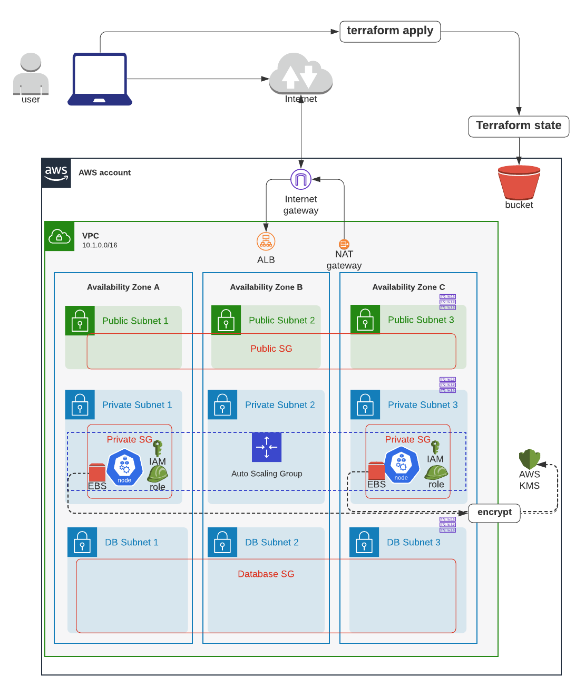
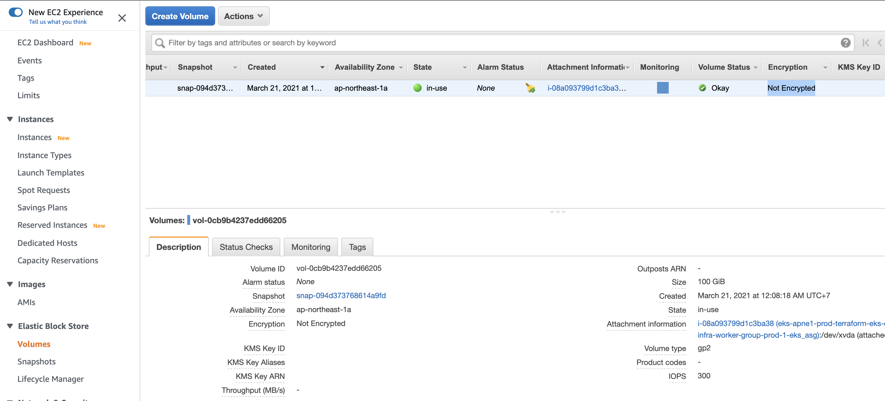
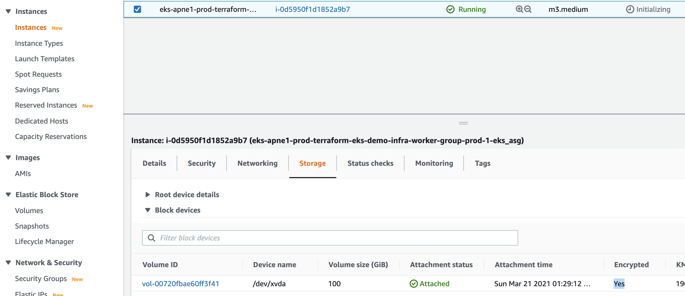
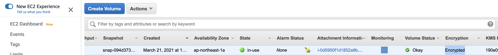

# Encrypt AWS EBS Volumes used by AWS EKS Worker Nodes




# Step 1: Set flag to encrypt root volume to true in Composition layer

In AWS EKS Terraform module source code that we copied to [resource_modules/container/eks/local.tf](resource_modules/container/eks/local.tf), the default value for `root_encrypted` is set to false:
```sh
workers_group_defaults_defaults = {
    root_encrypted                       = false  # Whether the volume should be encrypted or not
```

To set this value from `composition` layer, set it in [composition/eks-demo-infra/ap-northeast-1/prod/terraform.tfvars](composition/eks-demo-infra/ap-northeast-1/prod/terraform.tfvars),
```sh
worker_groups = [
  {
    name                 = "worker-group-prod-1"
    instance_type        = "m3.medium" # since we are using AWS-VPC-CNI, allocatable pod IPs are defined by instance size: https://docs.google.com/spreadsheets/d/1MCdsmN7fWbebscGizcK6dAaPGS-8T_dYxWp0IdwkMKI/edit#gid=1549051942, https://github.com/awslabs/amazon-eks-ami/blob/master/files/eni-max-pods.txt
    asg_max_size         = 2
    asg_min_size         = 1
    asg_desired_capacity = 1 # this will be ignored if cluster autoscaler is enabled: asg_desired_capacity: https://github.com/terraform-aws-modules/terraform-aws-eks/blob/master/docs/autoscaling.md#notes
    root_encrypted      = true # <------------------- STEP 1
    tags = [
      {
        "key"                 = "unmanaged-node"
        "propagate_at_launch" = "true"
        "value"               = "true"
      },
    ]
  },
]
```


# Step 2: Create AWS KMS Key module to encrypt EKS worker node's root EBS volume in infrastructure layer

Same for `root_kms_key_id` in [resource_modules/container/eks/local.tf](resource_modules/container/eks/local.tf) is set to empty.
```sh
workers_group_defaults_defaults = {
  root_kms_key_id                      = ""  # The KMS key to use when encrypting the root storage device
```


To set `root_kms_key_id` value from `infrastructure` layer (why not `composition` layer? To encapsulate low level implementation details in the facade `infrastructure` layer. All `composition` layer needs to know is to set the flag `root_encrypted` true), set it in [infrastructure_modules/eks/main.tf](infrastructure_modules/eks/main.tf):

```sh
# ref: https://github.com/terraform-aws-modules/terraform-aws-eks/blob/master/examples/basic/main.tf#L125-L160
module "eks_cluster" {
  source = "../../resource_modules/container/eks"

  create_eks      = var.create_eks
  cluster_version = var.cluster_version
  cluster_name    = var.cluster_name
  kubeconfig_name = var.cluster_name
  vpc_id          = var.vpc_id
  subnets         = var.subnets

  worker_groups                        = var.worker_groups
  node_groups                          = var.node_groups
  worker_additional_security_group_ids = var.worker_additional_security_group_ids

  kubeconfig_aws_authenticator_env_variables = var.kubeconfig_aws_authenticator_env_variables

  key_name = module.key_pair.key_name

  # use KMS key to encrypt EKS worker node's root EBS volumes
  root_kms_key_id = module.eks_node_ebs_kms_key.arn # <------------ STEP 2

  # WARNING: changing this will force recreating an entire EKS cluster!!!
  # enable k8s secret encryption using AWS KMS. Ref: https://github.com/terraform-aws-modules/terraform-aws-eks/blob/master/examples/secrets_encryption/main.tf#L88
  cluster_encryption_config = [
    {
      provider_key_arn = module.k8s_secret_kms_key.arn
      resources        = ["secrets"]
    }
  ]

  tags = var.tags
}

########################################
## KMS for EKS node's EBS volume
########################################
module "eks_node_ebs_kms_key" {
  source = "../../resource_module/identity/kms_key"

  name                    = local.eks_node_ebs_kms_key_name
  description             = local.eks_node_ebs_kms_key_description
  deletion_window_in_days = local.eks_node_ebs_kms_key_deletion_window_in_days
  tags                    = local.eks_node_ebs_kms_key_tags
  policy                  = data.aws_iam_policy_document.ebs_decryption.json
  enable_key_rotation     = true
}
```

In [infrastructure_modules/eks/data.tf](infrastructure_modules/eks/data.tf), define local variables
```sh
locals {
  ########################################
  ##  KMS for EKS node's EBS volume
  ########################################
  eks_node_ebs_kms_key_name                    = "alias/cmk-${var.region_tag[var.region]}-${var.env}-eks-node-ebs-volume"
  eks_node_ebs_kms_key_description             = "Kms key used for EKS node's EBS volume"
  eks_node_ebs_kms_key_deletion_window_in_days = "30"
  eks_node_ebs_kms_key_tags = merge(
    var.tags,
    map("Name", local.eks_node_ebs_kms_key_name)
  )
}
```

Also define AWS IAM policy for AWS KMS key in [infrastructure_modules/eks/data.tf](infrastructure_modules/eks/data.tf):
```sh
# ref: https://github.com/terraform-aws-modules/terraform-aws-eks/blob/master/examples/launch_templates_with_managed_node_groups/disk_encryption_policy.tf
# This policy is required for the KMS key used for EKS root volumes, so the cluster is allowed to enc/dec/attach encrypted EBS volumes
data "aws_iam_policy_document" "ebs_decryption" {
  # Copy of default KMS policy that lets you manage it
  statement {
    sid    = "Allow access for Key Administrators"
    effect = "Allow"

    principals {
      type        = "AWS"
      identifiers = ["arn:aws:iam::${data.aws_caller_identity.this.account_id}:root"]
    }

    actions = [
      "kms:*"
    ]

    resources = ["*"]
  }

  # Required for EKS
  statement {
    sid    = "Allow service-linked role use of the CMK"
    effect = "Allow"

    principals {
      type = "AWS"
      identifiers = [
        "arn:aws:iam::${data.aws_caller_identity.this.account_id}:role/aws-service-role/autoscaling.amazonaws.com/AWSServiceRoleForAutoScaling", # required for the ASG to manage encrypted volumes for nodes
        module.eks_cluster.cluster_iam_role_arn,
        "arn:aws:iam::${data.aws_caller_identity.this.account_id}:root", # required for the cluster / persistentvolume-controller to create encrypted PVCs
      ]
    }

    actions = [
      "kms:Encrypt",
      "kms:Decrypt",
      "kms:ReEncrypt*",
      "kms:GenerateDataKey*",
      "kms:DescribeKey"
    ]

    resources = ["*"]
  }

  statement {
    sid    = "Allow attachment of persistent resources"
    effect = "Allow"

    principals {
      type = "AWS"
      identifiers = [
        "arn:aws:iam::${data.aws_caller_identity.this.account_id}:role/aws-service-role/autoscaling.amazonaws.com/AWSServiceRoleForAutoScaling", # required for the ASG to manage encrypted volumes for nodes
        module.eks_cluster.cluster_iam_role_arn,                                                                                                 # required for the cluster / persistentvolume-controller to create encrypted PVCs
      ]
    }

    actions = [
      "kms:CreateGrant"
    ]

    resources = ["*"]

    condition {
      test     = "Bool"
      variable = "kms:GrantIsForAWSResource"
      values   = ["true"]
    }

  }
}
```


In [resource_modules/container/eks/variables.tf](resource_modules/container/eks/variables.tf), define an input variable `root_kms_key_id`
```sh
variable "root_kms_key_id" {
  default = ""
}
```

In [resource_modules/container/eks/local.tf](resource_modules/container/eks/local.tf), set it to `var.root_kms_key_id`
```sh
workers_group_defaults_defaults = {
  root_kms_key_id                      = var.root_kms_key_id  # The KMS key to use when encrypting the root storage device
```


# Step 3: Create AWS KMS module in Resource layer

In [resource_modules/identity/kms_key](resource_modules/identity/kms_key.tf), create .tf files for KMS key
```sh
########################################
# AWS KMS key resource
#
# https://www.terraform.io/docs/providers/aws/r/kms_key.html
########################################

resource "aws_kms_key" "this" {
  description             = var.description
  deletion_window_in_days = var.deletion_window_in_days
  tags                    = var.tags
  policy                  = var.policy
  enable_key_rotation     = var.enable_key_rotation
}

resource "aws_kms_alias" "this" {
  name          = var.name
  target_key_id = aws_kms_key.this.key_id
}
```


# Step 4: Terraform apply

Then run terraform commands
```sh
cd composition/eks-demo-infra/ap-northeast-1/prod

# will use remote backend
terraform init -backend-config=backend.config

# usual steps
terraform plan
terraform apply

# output 
  + create
  ~ update in-place
+/- create replacement and then destroy

Terraform will perform the following actions:

  # module.eks.module.eks_cluster.aws_autoscaling_group.workers[0] will be updated in-place
  ~ resource "aws_autoscaling_group" "workers" {
        id                        = "eks-apne1-prod-terraform-eks-demo-infra-worker-group-prod-120210320170812217400000002"
      ~ launch_configuration      = "eks-apne1-prod-terraform-eks-demo-infra-worker-group-prod-120210320170807199800000001" -> (known after apply)
        name                      = "eks-apne1-prod-terraform-eks-demo-infra-worker-group-prod-120210320170812217400000002"
        # (22 unchanged attributes hidden)

        # (6 unchanged blocks hidden)
    }

  # module.eks.module.eks_cluster.aws_launch_configuration.workers[0] must be replaced
+/- resource "aws_launch_configuration" "workers" {
      ~ arn                              = "arn:aws:autoscaling:ap-northeast-1:266981300450:launchConfiguration:fb6b389a-6608-4eaf-8327-44ff21ad6a60:launchConfigurationName/eks-apne1-prod-terraform-eks-demo-infra-worker-group-prod-120210320170807199800000001" -> (known after apply)
      ~ id                               = "eks-apne1-prod-terraform-eks-demo-infra-worker-group-prod-120210320170807199800000001" -> (known after apply)
      + key_name                         = (known after apply)
      ~ name                             = "eks-apne1-prod-terraform-eks-demo-infra-worker-group-prod-120210320170807199800000001" -> (known after apply)
      - vpc_classic_link_security_groups = [] -> null
        # (9 unchanged attributes hidden)

      + ebs_block_device {
          + delete_on_termination = (known after apply)
          + device_name           = (known after apply)
          + encrypted             = (known after apply) # <--------- this changed
          + iops                  = (known after apply)
          + no_device             = (known after apply)
          + snapshot_id           = (known after apply)
          + volume_size           = (known after apply)
          + volume_type           = (known after apply)
        }

      + metadata_options {
          + http_endpoint               = (known after apply)
          + http_put_response_hop_limit = (known after apply)
          + http_tokens                 = (known after apply)
        }

      ~ root_block_device {
          ~ encrypted             = false -> true # forces replacement # <--------- this changed
            # (4 unchanged attributes hidden)
        }
    }

  # module.eks.module.eks_cluster.random_pet.workers[0] must be replaced
+/- resource "random_pet" "workers" {
      ~ id        = "light-aardvark" -> (known after apply)
      ~ keepers   = {
          - "lc_name" = "eks-apne1-prod-terraform-eks-demo-infra-worker-group-prod-120210320170807199800000001"
        } -> (known after apply) # forces replacement
        # (2 unchanged attributes hidden)
    }

  # module.eks.module.eks_node_ebs_kms_key.aws_kms_alias.this will be created
  + resource "aws_kms_alias" "this" {
      + arn            = (known after apply)
      + id             = (known after apply)
      + name           = "alias/cmk-apne1-prod-eks-node-ebs-volume"
      + target_key_arn = (known after apply)
      + target_key_id  = (known after apply)
    }

  # module.eks.module.eks_node_ebs_kms_key.aws_kms_key.this will be created
  + resource "aws_kms_key" "this" {
      + arn                      = (known after apply)
      + customer_master_key_spec = "SYMMETRIC_DEFAULT"
      + deletion_window_in_days  = 30
      + description              = "Kms key used for EKS node's EBS volume"
      + enable_key_rotation      = true
      + id                       = (known after apply)
      + is_enabled               = true
      + key_id                   = (known after apply)
      + key_usage                = "ENCRYPT_DECRYPT"
      + policy                   = jsonencode(
            {
              + Statement = [
                  + {
                      + Action    = "kms:*"
                      + Effect    = "Allow"
                      + Principal = {
                          + AWS = "arn:aws:iam::266981300450:root"
                        }
                      + Resource  = "*"
                      + Sid       = "Allow access for Key Administrators"
                    },
                  + {
                      + Action    = [
                          + "kms:ReEncrypt*",
                          + "kms:GenerateDataKey*",
                          + "kms:Encrypt",
                          + "kms:DescribeKey",
                          + "kms:Decrypt",
                        ]
                      + Effect    = "Allow"
                      + Principal = {
                          + AWS = [
                              + "arn:aws:iam::266981300450:root",
                              + "arn:aws:iam::266981300450:role/eks-apne1-prod-terraform-eks-de20210320164725216500000001",
                              + "arn:aws:iam::266981300450:role/aws-service-role/autoscaling.amazonaws.com/AWSServiceRoleForAutoScaling",
                            ]
                        }
                      + Resource  = "*"
                      + Sid       = "Allow service-linked role use of the CMK"
                    },
                  + {
                      + Action    = "kms:CreateGrant"
                      + Condition = {
                          + Bool = {
                              + kms:GrantIsForAWSResource = [
                                  + "true",
                                ]
                            }
                        }
                      + Effect    = "Allow"
                      + Principal = {
                          + AWS = [
                              + "arn:aws:iam::266981300450:role/eks-apne1-prod-terraform-eks-de20210320164725216500000001",
                              + "arn:aws:iam::266981300450:role/aws-service-role/autoscaling.amazonaws.com/AWSServiceRoleForAutoScaling",
                            ]
                        }
                      + Resource  = "*"
                      + Sid       = "Allow attachment of persistent resources"
                    },
                ]
              + Version   = "2012-10-17"
            }
        )
      + tags                     = {
          + "Application" = "terraform-eks-demo-infra"
          + "Environment" = "prod"
          + "Name"        = "alias/cmk-apne1-prod-eks-node-ebs-volume"
        }
    }

Plan: 4 to add, 1 to change, 2 to destroy.
```

# Step 5: Confirm root EBS volume is encrypted

AWS EC2 -> Volume shows the root volume is unecrypted.


Terminate the EC2 (worker node) so that AWS ASG will spin up a new EC2 using the updated Launch Config that encrypts root EBS volume.


