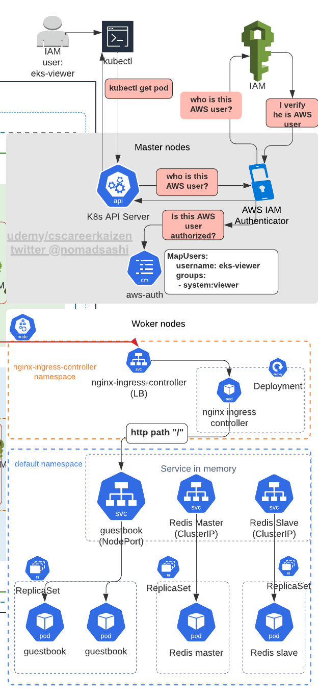
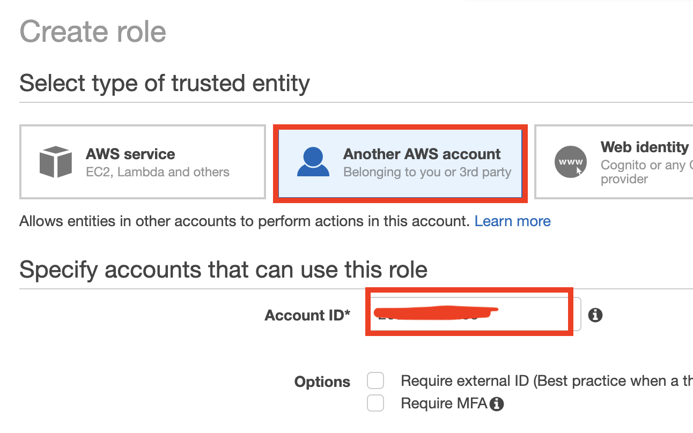
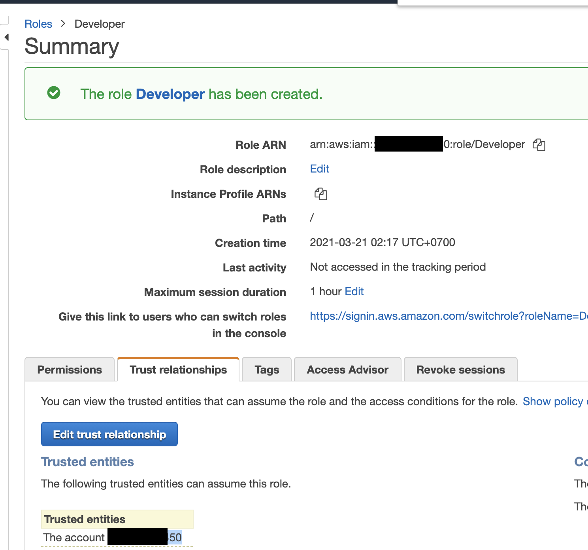

# AWS User Authentication and Authorization in K8s Cluster using aws-auth configmap and clusterrolebinding




# Step 1: Understand how to configure AWS IAM roles, users, and accounts in K8s using aws-auth

In AWS EKS Terraform module source code that we copied to [resource_modules/container/eks/aws_auth.tf](resource_modules/container/eks/aws_auth.tf), `kubernetes_config_map` resource type is defined which Terraform will create in EKS cluster. This `aws-auth` configmap will contain who (AWS IAM role, user, account) will be allowed in EKS cluster:

```sh
resource "kubernetes_config_map" "aws_auth" {
  count      = var.create_eks && var.manage_aws_auth ? 1 : 0
  depends_on = [null_resource.wait_for_cluster[0]]

  metadata {
    name      = "aws-auth"
    namespace = "kube-system"
    labels = merge(
      {
        "app.kubernetes.io/managed-by" = "Terraform"
        # / are replaced by . because label validator fails in this lib 
        # https://github.com/kubernetes/apimachinery/blob/1bdd76d09076d4dc0362456e59c8f551f5f24a72/pkg/util/validation/validation.go#L166
        "terraform.io/module" = "terraform-aws-modules.eks.aws"
      },
      var.aws_auth_additional_labels
    )
  }

  data = {
    mapRoles = yamlencode(
      distinct(concat(
        local.configmap_roles,
        var.map_roles,
      ))
    )
    mapUsers    = yamlencode(var.map_users)
    mapAccounts = yamlencode(var.map_accounts)
  }
}
```

# Step 2: Define local variable "map_roles" in data.tf

In [composition/eks-demo-infra/ap-northeast-1/prod/main.tf](composition/eks-demo-infra/ap-northeast-1/prod/main.tf), set input variable `map_roles` from local variable `local.map_roles` (why local variable instead of input variable? Local variable allows conditional expression like `map_roles = var.authenticate_using_role == true ?`):

```sh
########################################
# EKS
########################################
module "eks" {
  source = "../../../../infrastructure_modules/eks"

  ## EKS ##
  create_eks      = var.create_eks
  cluster_version = var.cluster_version
  cluster_name    = local.cluster_name
  vpc_id          = local.vpc_id
  subnets         = local.private_subnets

  # note: either pass worker_groups or node_groups
  # this is for (EKSCTL API) unmanaged node group
  worker_groups = var.worker_groups

  # this is for (EKS API) managed node group
  node_groups = var.node_groups

  # add roles that can access K8s cluster
  map_roles = local.map_roles  # <------------------ STEP 2
```

Then define local variable in [composition/eks-demo-infra/ap-northeast-1/prod/data.tf](composition/eks-demo-infra/ap-northeast-1/prod/data.tf),
```sh
locals{
  map_roles = var.authenticate_using_role == true ? concat(var.map_roles, [
    {
      rolearn  = "arn:aws:iam::${data.aws_caller_identity.this.account_id}:role/${var.role_name}"  # <---------------- AWS IAM role ARN
      username = "k8s_terraform_builder"
      groups   = ["system:masters"] # <---------------- K8s group
    },
  ]) : var.map_roles
}
```


# Step 3: Pass down input variable "map_roles" to resource layer in infrastructure layer

In [infrastructure_modules/eks/main.tf](infrastructure_modules/eks/main.tf),
```sh
# ref: https://github.com/terraform-aws-modules/terraform-aws-eks/blob/master/examples/basic/main.tf#L125-L160
module "eks_cluster" {
  source = "../../resource_modules/container/eks"

  create_eks      = var.create_eks
  cluster_version = var.cluster_version
  cluster_name    = var.cluster_name
  kubeconfig_name = var.cluster_name
  vpc_id          = var.vpc_id
  subnets         = var.subnets

  worker_groups                        = var.worker_groups
  node_groups                          = var.node_groups
  worker_additional_security_group_ids = var.worker_additional_security_group_ids

  map_roles                                  = var.map_roles # <-------- STEP 3: pass down map_roles to resource layer's input variable
```

Also define input variable `map_roles` in [infrastructure_modules/eks/variables.tf](infrastructure_modules/eks/variables.tf)

```sh
variable "map_roles" {
  description = "Additional IAM roles to add to the aws-auth configmap. See examples/basic/variables.tf for example format."
  type = list(object({
    rolearn  = string
    username = string
    groups   = list(string)
  }))

  default = []
  # default = [
  #   {
  #     rolearn  = "arn:aws:iam::66666666666:role/role1"
  #     username = "role1"
  #     groups   = ["system:masters"]
  #   },
  # ]
}
```


# Step 4: Check AWS IAM role "Developer" isn't part of aws-auth configmap by default

Before apply, check current contents of `aws-auth` configmap in `kube-system` namespace
```sh
$ k describe configmap aws-auth -n kube-system 

Name:         aws-auth
Namespace:    kube-system
Labels:       app.kubernetes.io/managed-by=Terraform
              terraform.io/module=terraform-aws-modules.eks.aws
Annotations:  <none>

Data
====
mapAccounts:
----
[]

mapRoles:
----
- "groups":
  - "system:bootstrappers"    
  - "system:nodes"
  "rolearn": "arn:aws:iam::xxxx:role/eks-apne1-prod-terraform-eks-de2021032016565461450000000f" # <--------- by default, AWS entity who created EKS cluster will be allowed
  "username": "system:node:{{EC2PrivateDNSName}}"

mapUsers:
----
[]

Events:  <none>
```


# Step 5: Terraform apply

Then run terraform commands
```sh
cd composition/eks-demo-infra/ap-northeast-1/prod

# will use remote backend
terraform init -backend-config=backend.config

# usual steps
terraform plan
terraform apply

# output 
  + create
  ~ update in-place
+/- create replacement and then destroy

Terraform will perform the following actions:

    # module.eks.module.eks_cluster.kubernetes_config_map.aws_auth[0] will be updated in-place
  ~ resource "kubernetes_config_map" "aws_auth" {
      ~ data        = {
          ~ "mapRoles"    = <<-EOT
                - "groups":
                  - "system:bootstrappers"
                  - "system:nodes"
                  "rolearn": "arn:aws:iam::xxx:role/eks-apne1-prod-terraform-eks-de2021032016565461450000000f" # <------ CHANGE
                  "username": "system:node:{{EC2PrivateDNSName}}"
              + - "groups":
              +   - "system:masters"
              +   "rolearn": "arn:aws:iam::xxx:role/Admin"
              +   "username": "k8s_terraform_builder"
              + - "groups":
              +   - "k8s-developer"
              +   "rolearn": "arn:aws:iam::xxx:role/Developer"
              +   "username": "k8s-developer"
            EOT
            # (2 unchanged elements hidden)
        }
        id          = "kube-system/aws-auth"
        # (1 unchanged attribute hidden)

        # (1 unchanged block hidden)
    }

Plan: 0 to add, 1 to change, 0 to destroy.
```


# Step 6: Confirm aws-auth configmap contains "Developer" AWS IAM role, and Developer role can authenticate to EKS cluster

## 6.1  Check `aws-auth` configmap contains sets of IAM Roles specifid in `map_roles` local variable

```sh
$ k describe configmap aws-auth -n kube-system 

Name:         aws-auth
Namespace:    kube-system
Labels:       app.kubernetes.io/managed-by=Terraform
              terraform.io/module=terraform-aws-modules.eks.aws
Annotations:  <none>

Data
====
mapAccounts:
----
[]

mapRoles:
----
- "groups":
  - "system:bootstrappers"
  - "system:nodes"
  "rolearn": "arn:aws:iam::xxx:role/eks-apne1-prod-terraform-eks-de2021032016565461450000000f"
  "username": "system:node:{{EC2PrivateDNSName}}"
- "groups":
  - "system:masters"
  "rolearn": "arn:aws:iam::xxx:role/Admin"   # <---------- ADDED
  "username": "k8s_terraform_builder"
- "groups":
  - "k8s-developer"
  "rolearn": "arn:aws:iam::xxx:role/Developer" # <---------- ADDED
  "username": "k8s-developer"

mapUsers:
----
[]

Events:  <none>
```


## 6.2 Create `DeveloperRoleAssumeRolePolicy` IAM policy so that AWS IAM users can assume `Developer` role
```sh
{
    "Version": "2012-10-17",
    "Statement": [
        {
            "Sid": "VisualEditor0",
            "Effect": "Allow",
            "Action": "sts:AssumeRole",
            "Resource": "arn:aws:iam::xxx:role/Developer"
        }
    ]
}
```


## 6.3 Create AWS IAM role `Developer` which can contain any permissions (for EKS authentication, we don't need any AWS permissions though)
__Make sure__ to add your AWS account # in trusted entities so that `Developer` role can be assumed by AWS IAM users in the same account.





## 6.4 Create AWS IAM user `goemon` (arbitrary name but this is from a Japanese cartoon called Lupin the third) and attach `DeveloperRoleAssumeRolePolicy` policy to it


## 6.5 Assume `Developer` role

Add `[profile aws-demo-developer]` in `~/.aws/config`
```sh
[profile aws-demo]
region = ap-northeast-1

[profile aws-demo-developer]
role_arn = arn:aws:iam::xxxx:role/Developer  # <------ specify IAM role ARN you want to assume under aws-demo-developer profile name
source_profile = aws-demo-goemon  # <----- refer to the AWS Profile name 
region = ap-northeast-1
```

Add `[aws-demo-goemon]` in `~/.aws/credentials`
```sh
[aws-demo] # <----- AWS Profile name for IAM user "aws-demo"
aws_access_key_id = xxxxx
aws_secret_access_key = xxxx

[aws-demo-goemon] # <----- AWS Profile name for IAM user "goemon"
aws_access_key_id = zzz
aws_secret_access_key = zzz
```


Assume role is as easy as exporting `AWS_PROFILE`
```sh
export AWS_PROFILE=aws-demo-developer

# verity authentication to AWS works
aws sts get-caller-identity
{
    "UserId": "AROAT4KKTLDRGDN6S672W:botocore-session-1616267869",
    "Account": "xxxx",
    "Arn": "arn:aws:sts::xxxx:assumed-role/Developer/botocore-session-1616267869" # <---- assuming role is SUCCESS!
}
```


## 6.6 Access K8s cluster as `Developer` AWS IAM role

```sh
kubectl get configmap -n kube-system

# expected output (can get authenticated but not authorized)
Error from server (Forbidden): pods is forbidden: User "k8s-developer" cannot list resource "pods" in API group "" in the namespace "default"
```

Back to `aws-demo` user (since `aws-demo` user has admin rights to edit AWS EKS)
```sh
export AWS_PROFILE=aws-demo
```

Comment out `map_roles` in [composition/eks-demo-infra/ap-northeast-1/prod/data.tf](composition/eks-demo-infra/ap-northeast-1/prod/data.tf) and check if `Developer` IAM role's access will be revoked
```sh
map_roles = var.authenticate_using_role == true ? concat(var.map_roles, [
    {
      rolearn  = "arn:aws:iam::${data.aws_caller_identity.this.account_id}:role/${var.role_name}"
      username = "k8s_terraform_builder"
      groups   = ["system:masters"]
    },
    # {
    #   rolearn  = "arn:aws:iam::${data.aws_caller_identity.this.account_id}:role/Developer"
    #   username = "k8s-developer"
    #   groups   = ["k8s-developer"]
    # },
  ]) : var.map_roles
```

```sh
terraform apply

# plan output
  # module.eks.module.eks_cluster.kubernetes_config_map.aws_auth[0] will be updated in-place
  ~ resource "kubernetes_config_map" "aws_auth" {
      ~ data        = {
          ~ "mapRoles"    = <<-EOT
                - "groups":
                  - "system:bootstrappers"
                  - "system:nodes"
                  "rolearn": "arn:aws:iam::xxx:role/eks-apne1-prod-terraform-eks-de2021032016565461450000000f"
                  "username": "system:node:{{EC2PrivateDNSName}}"
                - "groups":
                  - "system:masters"
                  "rolearn": "arn:aws:iam::xxx:role/Admin"
                  "username": "k8s_terraform_builder"
              - - "groups":
              -   - "k8s-developer"
              -   "rolearn": "arn:aws:iam::xxx:role/Developer" # <----- this role will be removed
              -   "username": "k8s-developer"
            EOT
            # (2 unchanged elements hidden)
        }
        id          = "kube-system/aws-auth"
        # (1 unchanged attribute hidden)

        # (1 unchanged block hidden)
    }

Plan: 0 to add, 1 to change, 0 to destroy.
```

```sh
kubectl describe configmap aws-auth -n kube-system 

Name:         aws-auth
Namespace:    kube-system
Labels:       app.kubernetes.io/managed-by=Terraform
              terraform.io/module=terraform-aws-modules.eks.aws
Annotations:  <none>

Data
====
mapAccounts:
----
[]

mapRoles:
----
- "groups":
  - "system:bootstrappers"
  - "system:nodes"
  "rolearn": "arn:aws:iam::xxx:role/eks-apne1-prod-terraform-eks-de2021032016565461450000000f"
  "username": "system:node:{{EC2PrivateDNSName}}"
- "groups":
  - "system:masters"
  "rolearn": "arn:aws:iam::xxx:role/Admin"  # <------ Developer role is gone now
  "username": "k8s_terraform_builder"

mapUsers:
----
[]

Events:  <none>
```


Switch to `goemon` AWS IAM user and try to access K8s cluster which will fail
```sh
export AWS_PROFILE=aws-demo-goemon

aws sts get-caller-identity
{
    "UserId": "AIDAT4KKTLDRB2KPIQ4Y5",
    "Account": "xxx",
    "Arn": "arn:aws:iam::xxx:user/goemon"
}

kubectl get pod
# expected result
error: You must be logged in to the server (Unauthorized)
```

Assume `Developer` AWS IAM role and try to access K8s cluster which will fail too

```sh
export AWS_PROFILE=aws-demo-developer

aws sts get-caller-identity
{
    "UserId": "AROAT4KKTLDRGDN6S672W:botocore-session-1616267869",
    "Account": "xxx",
    "Arn": "arn:aws:sts::xxx:assumed-role/Developer/botocore-session-1616267869"
}

kubectl get pod
# expected result
error: You must be logged in to the server (Unauthorized)
```


Finally, uncomment out `map_roles` in [composition/eks-demo-infra/ap-northeast-1/prod/data.tf](composition/eks-demo-infra/ap-northeast-1/prod/data.tf)
```sh
map_roles = var.authenticate_using_role == true ? concat(var.map_roles, [
    {
      rolearn  = "arn:aws:iam::${data.aws_caller_identity.this.account_id}:role/${var.role_name}"
      username = "k8s_terraform_builder"
      groups   = ["system:masters"]
    },
    {
      rolearn  = "arn:aws:iam::${data.aws_caller_identity.this.account_id}:role/Developer"
      username = "k8s-developer"
      groups   = ["k8s-developer"]
    },
  ]) : var.map_roles
```

Switch back to `aws-demo` profile and terraform apply
```sh
export AWS_PROFILE=aws-demo
terraform apply
```


Assume `Developer` AWS IAM role and try to access K8s cluster which should SUCCEED

```sh
export AWS_PROFILE=aws-demo-developer

aws sts get-caller-identity
{
    "UserId": "AROAT4KKTLDRGDN6S672W:botocore-session-1616267869",
    "Account": "xxx",
    "Arn": "arn:aws:sts::xxx:assumed-role/Developer/botocore-session-1616267869"
}

kubectl get pod

# expected result, authentication worked but authorization failed
Error from server (Forbidden): pods is forbidden: User "k8s-developer" cannot list resource "pods" in API group "" in the namespace "default"
```

This error for authorization is expected as we haven't defined k8s clusterrole or k8s group name called `k8s-developer`, however this verifies __authentication__ to the cluster works!


By the way, if you try to access K8s cluster as `goemon` AWS IAM user, that'll fail by default, as we are only setting permitted AWS IAM roles in `map_roles` local variable, not IAM users in `map_users` input variable (you can do that as well, but using IAM role with AWS is best practice anyways)
```sh
export AWS_PROFILE=aws-demo-goemon

kubectl get pod

# authentication doesn't even work
error: You must be logged in to the server (Unauthorized)
```

Next step is to fix k8s authorization issue.


# Step 7: Create ClusterRoleBinding `k8s-developer` associated with AWS IAM role `Developer` in aws-auth configmap for Authorization

There is a default `view` cluster role already created in cluster
```sh
export AWS_PROFILE=aws-demo

kubectl get clusterrole | grep view

system:aggregate-to-view                                               2021-03-20T16:54:56Z
system:public-info-viewer                                              2021-03-20T16:54:56Z
view                                                                   2021-03-20T16:54:56Z
```

Let's bind `view` clusterrole to `k8s-developer` k8s group in ClusterRoleBinding.

In [composition/eks-demo-infra/ap-northeast-1/prod/clusterrolebinding_k8s_developer.yaml](composition/eks-demo-infra/ap-northeast-1/prod/clusterrolebinding_k8s_developer.yaml),
```sh
apiVersion: rbac.authorization.k8s.io/v1beta1
kind: ClusterRoleBinding
metadata:
  name: k8s-developer
roleRef:
  apiGroup: rbac.authorization.k8s.io
  kind: ClusterRole
  name: view # <------ reference the existing "view" clusterrole
subjects:
- apiGroup: rbac.authorization.k8s.io
  kind: Group
  name: k8s-developer # <------ create "k8s-developer" k8s group
```

Apply
```sh
kubectl apply -f clusterrolebinding_k8s_developer.yaml

# output 
clusterrolebinding.rbac.authorization.k8s.io/k8s-developer created
```

Check the ClusterRoleBinding created
```sh
kubectl get clusterrolebinding | grep k8s-developer

# output 
k8s-developer        ClusterRole/view         26s

# describe
kubectl describe clusterrolebinding k8s-developer

Name:         k8s-developer
Labels:       <none>
Annotations:  <none>
Role:
  Kind:  ClusterRole
  Name:  view
Subjects:
  Kind   Name           Namespace
  ----   ----           ---------
  Group  k8s-developer  
```

Now, `aws-demo-developer` can read most of K8s resources thanks to `view` cluster role bound to `k8s-developer` k8s group which we defined in [composition/eks-demo-infra/ap-northeast-1/prod/data.tf](composition/eks-demo-infra/ap-northeast-1/prod/data.tf)
```sh
map_roles = var.authenticate_using_role == true ? concat(var.map_roles, [
    {
      rolearn  = "arn:aws:iam::${data.aws_caller_identity.this.account_id}:role/${var.role_name}"
      username = "k8s_terraform_builder"
      groups   = ["system:masters"]
    },
    {
      rolearn  = "arn:aws:iam::${data.aws_caller_identity.this.account_id}:role/Developer"
      username = "k8s-developer"
      groups   = ["k8s-developer"] # <------- this k8s group was just created by clusterrolebinding
    },
  ]) : var.map_roles
```


Try to read something
```sh
export AWS_PROFILE=aws-demo-developer

kubectl get pod

# expected, no more errors
No resources found in default namespace.


kubectl get configmap -n kube-system

# works as well
NAME                                 DATA   AGE
aws-auth                             3      172m
coredns                              1      3h5m
cp-vpc-resource-controller           0      3h5m
eks-certificates-controller          0      3h6m
extension-apiserver-authentication   6      3h6m
kube-proxy                           1      3h5m
kube-proxy-config                    1      3h5m
```