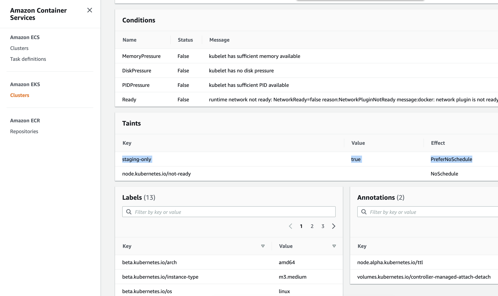

# Add K8s taint and label to worker nodes

# Step 1: Get taints and labels from worker nodes

```sh
kubectl get node

kubectl describe node ip-10-1-xx-xx.ap-northeast-1.compute.internal

# output shows labels and taints
Name:               ip-10-1-xxx-xxx.ap-northeast-1.compute.internal
Roles:              <none>
Labels:             beta.kubernetes.io/arch=amd64 # <---------- labels
                    beta.kubernetes.io/instance-type=m3.medium
                    beta.kubernetes.io/os=linux
                    failure-domain.beta.kubernetes.io/region=ap-northeast-1
                    failure-domain.beta.kubernetes.io/zone=ap-northeast-1a
                    kubernetes.io/arch=amd64
                    kubernetes.io/hostname=ip-10-1-xxx-xxx.ap-northeast-1.compute.internal
                    kubernetes.io/os=linux
                    node.kubernetes.io/instance-type=m3.medium
                    topology.kubernetes.io/region=ap-northeast-1
                    topology.kubernetes.io/zone=ap-northeast-1a
Annotations:        node.alpha.kubernetes.io/ttl: 0
                    volumes.kubernetes.io/controller-managed-attach-detach: true
CreationTimestamp:  Sun, 21 Mar 2021 01:30:28 +0700
Taints:             <none>    # <---------- labels
```


# Step 2: Add taints and labels

## 2.1 (Naive approach) You can manually add taint and label using kubectl CLI
```sh
kubectl taint nodes NODE deployment-env=staging:NoSchedule 

kubectl label node NODE deployment-env=staging
```

However, EKS worker nodes are wrapped in AWS ASG and they can __scale out and in anytime__ based on load (using Cluster Autoscaler which we'll cover in the later chapter). So manuall approach won't work.


So we need to configure these in kind of bootstrap arguments.

## 2.2 (Best practice) Use EKS Unmanaged Node Groups in favor EKSCTL Managed Group for ability to configure taints & custom userdata

#### Option 1 (better): Unmanaged Node Group (works for label, taint, userdata)
Unmanaged (by EKS API but managed by eksctl API) group's __downsides__ are that it can't propagate __AWS tags__ for label and taints to K8s node objects.

[Git issue: Unmanaged node group can't propagate ASG tags to K8s nodes](https://github.com/kubernetes/autoscaler/issues/1793#issuecomment-517417680)

[Git issue: Autoscaler not respecting the taint tag in AWS #2434](https://github.com/kubernetes/autoscaler/issues/2434#issuecomment-576479025)

> autoscaler (in unmanaged node group) won't apply labels & taints to node object, it will try to fetch from ASG tags and construct node with taints in CA memory


However, its __upside__ is it can still pass labels and taints using `kubelet-extra-args` for kubelet. Newly scaled up EC2 instances will automatically carry the label values. K8s labels can be used by Pod's `nodeSelector` attribute. 

> Without these tags, when the cluster autoscaler needs to increase the number of nodes, if a node group creates nodes with taints that the __pending pod does not tolerate__ then the cluster autoscaler will only learn about this after the node has been created and it sees that it is tainted. 


For [label example](https://aws.amazon.com/blogs/opensource/improvements-eks-worker-node-provisioning/)
```
--kubelet-extra-args --node-labels=mykey=myvalue,nodegroup=NodeGroup1
```

For [taint example](https://stackoverflow.com/questions/53198315/tainting-in-k8s)
```
--kubelet-extra-args --register-with-taints=key=value:NoSchedule
```

Combined together, 
```
kubelet_extra_args  = "--node-labels=env=staging,unmanaged-node=true --register-with-taints=staging-only=true:PreferNoSchedule"   # for unmanaged nodes, taints and labels work only with extra-arg, not ASG tags. Ref: https://aws.amazon.com/blogs/opensource/improvements-eks-worker-node-provisioning/                           
```


FYI, `kubelet_extra_args` is defined in [resource_modules/container/eks/local.tf](resource_modules/container/eks/local.tf)
```sh
locals {
  workers_group_defaults_defaults = {
    kubelet_extra_args            = ""                          # This string is passed directly to kubelet if set. Useful for adding labels or taints.
```

#### Option 2 (more limitations): Managed Node Group (works only for label)
Another option is to use [AWS EKS Managed Node Groups](https://docs.aws.amazon.com/eks/latest/userguide/managed-node-groups.html), which has less customizability than unmanaged node groups.

__One upside__ is that managed node group can propagate K8s labels from ASG tags to node (vs passing `kubelet-extra-args` to kubelet for unmanaged case). 

> Nodes launched as part of a managed node group are __automatically tagged for auto-discovery__ by the Kubernetes cluster autoscaler and you can use the node group to apply Kubernetes labels to nodes and update them at any time.

> Amazon EKS tags managed node group resources so that they are configured to use the Kubernetes Cluster Autoscaler.

> Amazon EKS adds Kubernetes labels to managed node group instances. These Amazon EKS-provided labels are prefixed with eks.amazon.com.

However, there are __some downsides__ to managed node groups ([eksctl doc](https://eksctl.io/usage/eks-managed-nodes/#feature-parity-with-unmanaged-nodegroups)):
> Control over the node bootstrapping process and customization of the kubelet are not supported. This includes the following fields: classicLoadBalancerNames, maxPodsPerNode, __taints__, targetGroupARNs, preBootstrapCommands, __overrideBootstrapCommand__, clusterDNS and __kubeletExtraConfig__.

Hence, there are open Git requests [[EKS] [request]: Managed Node Groups Custom Userdata support #596](https://github.com/aws/containers-roadmap/issues/596) and [[EKS] Managed Node Groups Launch Template Support #585](https://github.com/aws/containers-roadmap/issues/585) to support:
- taint nodes in the managed worker node autoscaling group
- support custom userdata to "Restricting Access to Amazon EC2 Instance Profile Credentials"


[Terraform AWS EKS module implementation of managed node groups](https://github.com/terraform-aws-modules/terraform-aws-eks/blob/master/examples/managed_node_groups/main.tf#L96)

```sh
node_groups_defaults = {
    ami_type  = "AL2_x86_64"
    disk_size = 50
  }

  node_groups = {
    example = {
      desired_capacity = 1
      max_capacity     = 10
      min_capacity     = 1

      instance_type = "m5.large"
      k8s_labels = { # <---------- label added
        Environment = "test"
        GithubRepo  = "terraform-aws-eks"
        GithubOrg   = "terraform-aws-modules"
      }
      additional_tags = {
        ExtraTag = "example"
      }
    }
  }
```


We will use option 1 of unmanaged group.

In [composition/eks-demo-infra/ap-northeast-1/prod/terraform.tfvars](composition/eks-demo-infra/ap-northeast-1/prod/terraform.tfvars), 

```sh
# WARNING: mixing managed and unmanaged node groups will render unmanaged nodes to be unable to connect to internet & join the cluster when restarting.
# gotcha: managed node group doesn't support 1) propagating taint to K8s nodes and 2) custom userdata. Ref: https://eksctl.io/usage/eks-managed-nodes/#feature-parity-with-unmanaged-nodegroups
node_groups = {   # <-------------------------- node_groups is for MANAGED workers
  # staging = {
  #   desired_capacity = 1
  #   max_capacity     = 3
  #   min_capacity     = 1

  #   instance_type = "m3.large"
  #   k8s_labels = {
  #     env = "staging"
  #     managed-node = "true"
  #     GithubRepo  = "terraform-aws-eks"
  #     GithubOrg   = "terraform-aws-modules"
  #   }
  #   additional_tags = {
  #     "k8s.io/cluster-autoscaler/managed-node" = "true",
  #     "k8s.io/cluster-autoscaler/enabled" = "true",
  #     "k8s.io/cluster-autoscaler/node-template/taint/staging-only" = "true:PreferNoSchedule" # currently managed group can't assign taint to nodes from tags. Ref: https://eksctl.io/usage/eks-managed-nodes/#feature-parity-with-unmanaged-nodegroups
  #   }
  # },
}

# note (only for unmanaged node group)
# gotcha: need to use kubelet_extra_args to propagate taints/labels to K8s node, because ASG tags not being propagated to k8s node objects.
# ref: https://github.com/kubernetes/autoscaler/issues/1793#issuecomment-517417680
# ref: https://github.com/kubernetes/autoscaler/issues/2434#issuecomment-576479025
worker_groups = [  # <-------------------------- worker_groups is for UNMANAGED workers
  {
    name                 = "worker-group-staging-1"
    instance_type        = "m3.medium" # since we are using AWS-VPC-CNI, allocatable pod IPs are defined by instance size: https://docs.google.com/spreadsheets/d/1MCdsmN7fWbebscGizcK6dAaPGS-8T_dYxWp0IdwkMKI/edit#gid=1549051942, https://github.com/awslabs/amazon-eks-ami/blob/master/files/eni-max-pods.txt
    asg_max_size         = 2
    asg_min_size         = 1
    asg_desired_capacity = 1 # this will be ignored if cluster autoscaler is enabled: asg_desired_capacity: https://github.com/terraform-aws-modules/terraform-aws-eks/blob/master/docs/autoscaling.md#notes
    kubelet_extra_args  = "--node-labels=env=staging,unmanaged-node=true --register-with-taints=staging-only=true:PreferNoSchedule"  # for unmanaged nodes, taints and labels work only with extra-arg, not ASG tags. Ref: https://aws.amazon.com/blogs/opensource/improvements-eks-worker-node-provisioning/   # <------------------ STEP 2
    root_encrypted      = true
```


# Step 3: Terraform apply

Then run terraform commands
```sh
cd composition/eks-demo-infra/ap-northeast-1/prod

# will use remote backend
terraform init -backend-config=backend.config

# usual steps
terraform plan
terraform apply

# output 
  + create
  ~ update in-place
+/- create replacement and then destroy

Terraform will perform the following actions:

      # module.eks.module.eks_cluster.aws_autoscaling_group.workers[0] will be updated in-place
  ~ resource "aws_autoscaling_group" "workers" {
        id                        = "eks-apne1-prod-terraform-eks-demo-infra-worker-group-prod-120210320170812217400000002"
      ~ launch_configuration      = "eks-apne1-prod-terraform-eks-demo-infra-worker-group-prod-120210320182257015500000001" -> (known after apply)
        name                      = "eks-apne1-prod-terraform-eks-demo-infra-worker-group-prod-120210320170812217400000002"
        # (22 unchanged attributes hidden)

        # (6 unchanged blocks hidden)
    }

  # module.eks.module.eks_cluster.aws_launch_configuration.workers[0] must be replaced
+/- resource "aws_launch_configuration" "workers" {
      ~ arn                              = "arn:aws:autoscaling:ap-northeast-1:266981300450:launchConfiguration:bb396006-1941-4be7-8fc0-0c769fe2aa3a:launchConfigurationName/eks-apne1-prod-terraform-eks-demo-infra-worker-group-prod-120210320182257015500000001" -> (known after apply)
      ~ id                               = "eks-apne1-prod-terraform-eks-demo-infra-worker-group-prod-120210320182257015500000001" -> (known after apply)
      + key_name                         = (known after apply)
      ~ name                             = "eks-apne1-prod-terraform-eks-demo-infra-worker-group-prod-120210320182257015500000001" -> (known after apply)
      ~ user_data_base64                 = "xxx" -> "zzz" # forces replacement # <------ EC2 userdata config will change due to "kubelet_extra_args" 
      - vpc_classic_link_security_groups = [] -> null
        # (8 unchanged attributes hidden)

      + ebs_block_device {
          + delete_on_termination = (known after apply)
          + device_name           = (known after apply)
          + encrypted             = (known after apply)
          + iops                  = (known after apply)
          + no_device             = (known after apply)
          + snapshot_id           = (known after apply)
          + volume_size           = (known after apply)
          + volume_type           = (known after apply)
        }

      + metadata_options {
          + http_endpoint               = (known after apply)
          + http_put_response_hop_limit = (known after apply)
          + http_tokens                 = (known after apply)
        }

        # (1 unchanged block hidden)
    }

  # module.eks.module.eks_cluster.random_pet.workers[0] must be replaced
+/- resource "random_pet" "workers" {
      ~ id        = "sterling-glider" -> (known after apply)
      ~ keepers   = {
          - "lc_name" = "eks-apne1-prod-terraform-eks-demo-infra-worker-group-prod-120210320182257015500000001"
        } -> (known after apply) # forces replacement
        # (2 unchanged attributes hidden)
    }

Plan: 2 to add, 1 to change, 2 to destroy.
```


# Step 4: Restart EC2 worker nodes so that the updated userdata script will apply taint and label to a new EC2


```sh
# get node DNS
kubectl get node

kubectl describe node ip-10-1-xx-xx.ap-northeast-1.compute.internal

# output shows customlabel and taints
Name:               ip-10-1-101-130.ap-northeast-1.compute.internal
Roles:              <none>
Labels:             beta.kubernetes.io/arch=amd64
                    beta.kubernetes.io/instance-type=m3.medium
                    beta.kubernetes.io/os=linux
                    env=staging      # <------------ label from "kubelet_extra_args"
                    failure-domain.beta.kubernetes.io/region=ap-northeast-1
                    failure-domain.beta.kubernetes.io/zone=ap-northeast-1a
                    kubernetes.io/arch=amd64
                    kubernetes.io/hostname=ip-10-1-101-130.ap-northeast-1.compute.internal
                    kubernetes.io/os=linux
                    node.kubernetes.io/instance-type=m3.medium
                    topology.kubernetes.io/region=ap-northeast-1
                    topology.kubernetes.io/zone=ap-northeast-1a
                    unmanaged-node=true
Annotations:        node.alpha.kubernetes.io/ttl: 0
                    volumes.kubernetes.io/controller-managed-attach-detach: true
CreationTimestamp:  Sun, 21 Mar 2021 04:09:53 +0700
Taints:             node.kubernetes.io/not-ready:PreferNoSchedule
                    staging-only=true:PreferNoSchedule # <------------ taint from "kubelet_extra_args"
```

Can also see taints and labels from AWS EKS > Clusters > eks-apne1-prod-terraform-eks-demo-infra > Node: ip-10-1-xx-xx.ap-northeast-1.compute.internal

