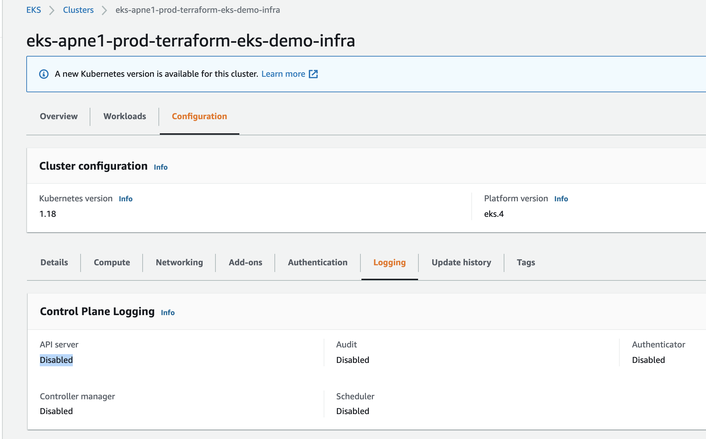
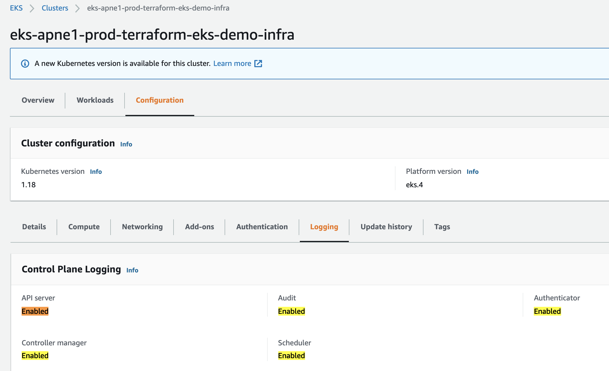

# Enable K8s Control Plane (Master Components) Logging

By default, control plane (Controller manager, API server, Audit, Scheduler, Authenticator) logs are disabled.



# Step 1: Know the input variable in resource module to enable control plane logging

In [resource_modules/container/eks/cluster.tf](resource_modules/container/eks/cluster.tf), `aws_eks_cluster` resource contains the argument called `enabled_cluster_log_types`:
```sh
resource "aws_eks_cluster" "this" {
  count                     = var.create_eks ? 1 : 0
  name                      = var.cluster_name
  enabled_cluster_log_types = var.cluster_enabled_log_types
```

In [resource_modules/container/eks/variables.tf](resource_modules/container/eks/variables.tf), you can see the description of this input variable
```sh
variable "cluster_enabled_log_types" {
  default     = []
  description = "A list of the desired control plane logging to enable. For more information, see Amazon EKS Control Plane Logging documentation (https://docs.aws.amazon.com/eks/latest/userguide/control-plane-logs.html)"
  type        = list(string)
}

variable "cluster_log_retention_in_days" {
  default     = 90
  description = "Number of days to retain log events. Default retention - 90 days."
  type        = number
}
```


# Step 2: Define `cluster_enabled_log_types` input variable value in terraform.tfvars in `Composition` layer

In [composition/eks-demo-infra/ap-northeast-1/prod/terraform.tfvars](composition/eks-demo-infra/ap-northeast-1/prod/terraform.tfvars), define values for cluster log and retention days
```sh
enabled_cluster_log_types     = ["api", "audit", "authenticator", "controllerManager", "scheduler"]  # <-------- STEP 2
cluster_log_retention_in_days = 365 # default 90 days, but auditing service Vanta requires min 1 year
```

In [composition/eks-demo-infra/ap-northeast-1/prod/main.tf](composition/eks-demo-infra/ap-northeast-1/prod/main.tf), pass down the `enabled_cluster_log_types` input variable to infrastructure layer:
```sh
########################################
# EKS
########################################
module "eks" {
  source = "../../../../infrastructure_modules/eks"

  ## EKS ##
  create_eks      = var.create_eks
  cluster_version = var.cluster_version
  cluster_name    = local.cluster_name
  vpc_id          = local.vpc_id
  subnets         = local.private_subnets

  # note: either pass worker_groups or node_groups
  # this is for (EKSCTL API) unmanaged node group
  worker_groups = var.worker_groups

  # this is for (EKS API) managed node group
  node_groups = var.node_groups

  # add roles that can access K8s cluster
  map_roles = local.map_roles

  # specify AWS Profile if you want kubectl to use a named profile to authenticate instead of access key and secret access key
  kubeconfig_aws_authenticator_env_variables = local.kubeconfig_aws_authenticator_env_variables

  enabled_cluster_log_types     = var.enabled_cluster_log_types  # <-------- STEP 2
  cluster_log_retention_in_days = var.cluster_log_retention_in_days
```

Also define `enabled_cluster_log_types` and `cluster_log_retention_in_days` input variables in [composition/eks-demo-infra/ap-northeast-1/prod/variables.tf](composition/eks-demo-infra/ap-northeast-1/prod/variables.tf),
```sh
variable "enabled_cluster_log_types" {
  default     = []
  description = "A list of the desired control plane logging to enable. For more information, see Amazon EKS Control Plane Logging documentation (https://docs.aws.amazon.com/eks/latest/userguide/control-plane-logs.html)"
  type        = list(string)
}

variable "cluster_log_retention_in_days" {
  default     = 90
  description = "Number of days to retain log events. Default retention - 90 days."
  type        = number
}
```


# Step 3: Pass down `enabled_cluster_log_types` input variable from infrastructure layer to resource module layer

In [infrastructure_modules/eks/main.tf](infrastructure_modules/eks/main.tf), set `cluster_enabled_log_types` value to resource module's `cluster_enabled_log_types`
```sh
# ref: https://github.com/terraform-aws-modules/terraform-aws-eks/blob/master/examples/basic/main.tf#L125-L160
module "eks_cluster" {
  source = "../../resource_modules/container/eks"

  create_eks      = var.create_eks
  cluster_version = var.cluster_version
  cluster_name    = var.cluster_name
  kubeconfig_name = var.cluster_name
  vpc_id          = var.vpc_id
  subnets         = var.subnets

  worker_groups                        = var.worker_groups
  node_groups                          = var.node_groups
  worker_additional_security_group_ids = var.worker_additional_security_group_ids

  map_roles                                  = var.map_roles
  kubeconfig_aws_authenticator_env_variables = var.kubeconfig_aws_authenticator_env_variables

  cluster_enabled_log_types     = var.enabled_cluster_log_types # <------- STEP 3
  cluster_log_retention_in_days = var.cluster_log_retention_in_days
```


Also define `enabled_cluster_log_types` and `cluster_log_retention_in_days` input variables in [infrastructure_modules/eks/variables.tf](infrastructure_modules/eks/variables.tf),
```sh
variable "enabled_cluster_log_types" {
  default     = []
  description = "A list of the desired control plane logging to enable. For more information, see Amazon EKS Control Plane Logging documentation (https://docs.aws.amazon.com/eks/latest/userguide/control-plane-logs.html)"
  type        = list(string)
}

variable "cluster_log_retention_in_days" {
  default     = 90
  description = "Number of days to retain log events. Default retention - 90 days."
  type        = number
}
```


# Step 4: Terraform apply

```sh
cd composition/eks-demo-infra/ap-northeast-1/prod

# will use remote backend
terraform init -backend-config=backend.config

# usual steps
terraform plan
terraform apply

# output 
  + create
  ~ update in-place
+/- create replacement and then destroy

Terraform will perform the following actions:

      # module.eks.module.eks_cluster.data.template_file.userdata[0] will be read during apply
  # (config refers to values not yet known)
 <= data "template_file" "userdata"  {
      ~ id       = "6dcf640bbea6d3bedf141829385d1a94b8eb0ffbfd854947ed75bea8522fe030" -> (known after apply)
      ~ rendered = <<-EOT
            #!/bin/bash -e
            
            # Allow user supplied pre userdata code
            
            
            # Bootstrap and join the cluster
            /etc/eks/bootstrap.sh --b64-cluster-ca 'zzz' --apiserver-endpoint 'https://8BCC4AF6E74FFBAEDA5F0675CCD92C4F.gr7.ap-northeast-1.eks.amazonaws.com'  --kubelet-extra-args "--node-labels=env=prod,unmanaged-node=true --register-with-taints=prod-only=true:NoSchedule" 'eks-apne1-prod-terraform-eks-demo-infra'
            
            # Allow user supplied userdata code
        EOT -> (known after apply)
        # (2 unchanged attributes hidden)
    }

  # module.eks.module.eks_cluster.aws_autoscaling_group.workers[0] will be updated in-place
  ~ resource "aws_autoscaling_group" "workers" {
        id                        = "eks-apne1-prod-terraform-eks-demo-infra-worker-group-prod-120210321184411189300000015"
      ~ launch_configuration      = "eks-apne1-prod-terraform-eks-demo-infra-worker-group-prod-120210321184834432000000001" -> (known after apply)
        name                      = "eks-apne1-prod-terraform-eks-demo-infra-worker-group-prod-120210321184411189300000015"
        # (22 unchanged attributes hidden)

        # (6 unchanged blocks hidden)
    }

  # module.eks.module.eks_cluster.aws_cloudwatch_log_group.this[0] will be created
  + resource "aws_cloudwatch_log_group" "this" {
      + arn               = (known after apply)
      + id                = (known after apply)
      + name              = "/aws/eks/eks-apne1-prod-terraform-eks-demo-infra/cluster"
      + retention_in_days = 365
      + tags              = {
          + "Application" = "terraform-eks-demo-infra"
          + "Environment" = "prod"
        }
    }

  # module.eks.module.eks_cluster.aws_eks_cluster.this[0] will be updated in-place
  ~ resource "aws_eks_cluster" "this" {
      ~ enabled_cluster_log_types = [  # <---------- CHANGE
          + "api",
          + "audit",
          + "authenticator",
          + "controllerManager",
          + "scheduler",
        ]
        id                        = "eks-apne1-prod-terraform-eks-demo-infra"
        name                      = "eks-apne1-prod-terraform-eks-demo-infra"
        tags                      = {
            "Application" = "terraform-eks-demo-infra"
            "Environment" = "prod"
        }
        # (9 unchanged attributes hidden)


        # (4 unchanged blocks hidden)
    }

  # module.eks.module.eks_cluster.aws_launch_configuration.workers[0] must be replaced
+/- resource "aws_launch_configuration" "workers" {
      ~ arn                              = "arn:aws:autoscaling:ap-northeast-1:266981300450:launchConfiguration:8c17c8fd-06a9-45ac-a0dd-1794397cecd7:launchConfigurationName/eks-apne1-prod-terraform-eks-demo-infra-worker-group-prod-120210321184834432000000001" -> (known after apply)
      ~ id                               = "eks-apne1-prod-terraform-eks-demo-infra-worker-group-prod-120210321184834432000000001" -> (known after apply)
      + key_name                         = (known after apply)
      ~ name                             = "eks-apne1-prod-terraform-eks-demo-infra-worker-group-prod-120210321184834432000000001" -> (known after apply)
      ~ user_data_base64                 = "zzz" -> (known after apply) # forces replacement
      - vpc_classic_link_security_groups = [] -> null
        # (8 unchanged attributes hidden)

      + ebs_block_device {
          + delete_on_termination = (known after apply)
          + device_name           = (known after apply)
          + encrypted             = (known after apply)
          + iops                  = (known after apply)
          + no_device             = (known after apply)
          + snapshot_id           = (known after apply)
          + volume_size           = (known after apply)
          + volume_type           = (known after apply)
        }

      + metadata_options {
          + http_endpoint               = (known after apply)
          + http_put_response_hop_limit = (known after apply)
          + http_tokens                 = (known after apply)
        }

        # (1 unchanged block hidden)
    }

  # module.eks.module.eks_cluster.random_pet.workers[0] must be replaced
+/- resource "random_pet" "workers" {
      ~ id        = "driving-tiger" -> (known after apply)
      ~ keepers   = {
          - "lc_name" = "eks-apne1-prod-terraform-eks-demo-infra-worker-group-prod-120210321184834432000000001"
        } -> (known after apply) # forces replacement
        # (2 unchanged attributes hidden)
    }

Plan: 3 to add, 2 to change, 2 to destroy.
```


# Step 5: Verify control plane logs are enabled on Console


